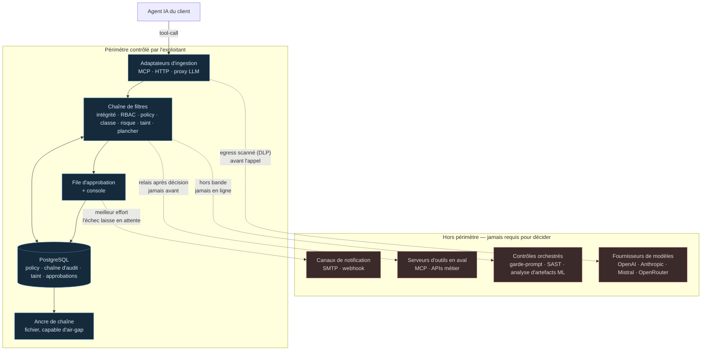

# Architecture souveraine — ce qui ne sort jamais du périmètre

> **Audience** : architecte ou RSSI qui évalue la revendication « souverain ».
> **Autorité** : `docs/product/ARCHITECTURE-V2.5.md` (`AD-25`, `AD-32`, `AD-34`) et
> `docs/product/THREAT-COVERAGE.md` §6.2. Ce document les rend lisibles ; il ne les
> modifie pas.

---

## 1. Le critère, avant le schéma

La question « êtes-vous souverain ? » se répond mal par la nationalité d'un éditeur.
Un logiciel écrit en France mais hébergé sous droit étranger ne l'est pas ; une
bibliothèque open source américaine exécutée localement sans rappel réseau ne perce
aucune chaîne.

**Le critère retenu est la dépendance opérationnelle** (`QO-3`, tranchée) :

> Une décision est-elle *prise, enregistrée et vérifiable* sans qu'aucun appel sorte
> du périmètre contrôlé par l'exploitant ?

C'est un critère testable, et il est testé : `AD-25` fait de la souveraineté une
propriété de CI, pas une promesse commerciale. La métrique associée est `SM-15` —
**appels sortants hors UE requis sur le chemin de décision : 0**.

---

## 2. Le périmètre

**La frontière n'est pas géographique.** Un hébergeur européen sous droit non
européen n'est pas une réponse. Elle est opérationnelle : rien de ce qui est hors
de la boîte n'est *requis* pour qu'une décision soit prise, écrite et vérifiée.

---

## 3. Chaque franchissement, et ce qu'il coûte s'il est coupé

| Sortie | Quand | Une décision en dépend ? | Coupée, il se passe quoi |
|---|---|---|---|
| **Serveur d'outils en aval** (relais du tool-call) | *Après* la décision d'autoriser, jamais avant | **Non** | L'action n'a pas lieu. C'est le comportement voulu : le contrôle a déjà statué. |
| **Fournisseur de modèle** (proxy LLM) | Sur le trafic que le client route par le proxy | **Non** | Le client perd l'accès au modèle, pas le contrôle. Le blocage DLP d'egress est en amont de cet appel et inconditionnel. |
| **Juge LLM** (classification des règles `ambiguous`) | Sur une règle `classify: ambiguous` uniquement | **Non** — et c'est explicite | Le juge absent contribue sa **classe d'échec** (`irreversible`), donc l'action part en approbation humaine au lieu d'être auto-autorisée (`AD-34`, `FR-198`). Le pipeline continue. |
| **Contrôles orchestrés** (garde-prompt, SAST, analyse de modèles) | Hors bande, en amont ou en aval | **Non** | La ligne de couverture correspondante retombe à son mode inférieur. Aucune ligne `Bloqué` native n'en dépend. |
| **Notification d'approbation** (SMTP, webhook) | À la création d'une approbation | **Non** | L'échec est journalisé et l'approbation **reste en attente** — donc l'action reste bloquée. L'échec penche du côté sûr. |
| **Vérification d'ancre externe** | À la demande, sur export | **Non** | La chaîne reste vérifiable localement (`verify_chain`). L'ancre externe renforce la preuve, elle ne la fonde pas. |

**Lecture.** Aucune ligne du tableau ne porte « oui ». C'est la revendication entière,
et c'est ce que `SM-15` mesure en continu.

---

## 4. Le prérequis que la souveraineté impose au client

`AD-32` : le chemin de décision n'exige **qu'un PostgreSQL contrôlé par
l'exploitant**. Pas un service managé d'un fournisseur particulier, pas une base
propriétaire, pas un second moteur de stockage (`§7.2` l'exclut).

Ce n'est pas une préférence esthétique. C'est ce qui rend le déploiement possible
chez un client dont la contrainte est « rien ne sort du SI », et c'est ce qui rend
l'air-gap atteignable : l'ancre de chaîne est un fichier.

**Le corollaire dur** : le client doit fournir un Postgres avec les privilèges de
migration. Un Postgres managé bridé — pas de `CREATE EXTENSION`, pas de rôle
propriétaire — est un blocage de déploiement, pas un détail d'installation. Il vaut
mieux le dire avant la signature qu'au premier `make migrate`.

---

## 5. Les contrôles orchestrés, et leur question de substitut

Une ligne de couverture en mode `Orchestré` signifie : *nous ne le bloquons pas
nous-mêmes, nous pilotons un contrôle tiers qui le fait, et nous en chaînons le
verdict dans l'audit.* Le tiers devient alors une dépendance — et la doctrine
s'applique à lui.

| Contrôle orchestré | Outil que la matrice source recommande | Statut du substitut |
|---|---|---|
| Garde-prompt (`M-01`, `G-01`) | NeMo Guardrails, Llama Guard | **Résolu** — Mistral, que la stack impose déjà. Aucun fournisseur nouveau. |
| Analyse d'artefacts ML (`M-11`, `G-10`) | picklescan, modelscan | S'exécute **localement**, sans rappel réseau. Ne perce pas la chaîne. |
| SAST / DAST (`M-15`, `G-14`) | Snyk, SonarQube | S'exécute **localement** en CI. Ne perce pas la chaîne. |
| Découverte du Shadow AI (`M-10`, `G-09`) | CASB du marché | **Aucun substitut souverain.** La ligne perd donc son statut `Orchestré` (`FR-178`) plutôt que de revendiquer une couverture qui traverserait la frontière. |

**La dernière ligne est la plus importante du tableau.** Elle montre ce que la
doctrine coûte quand elle est appliquée honnêtement : on retire une revendication
plutôt que de la tenir par un chemin qui contredit le discours. Trois contrôles sur
quatre s'exécutent localement ; le quatrième est déclassé.

---

## 6. Ce qui est tenu aujourd'hui, et ce qui reste à construire

`AD-25` pose que la souveraineté doit être une **propriété de CI** et non une
promesse. Elle ne l'est pas encore entièrement. La distinction est faite ici plutôt
que laissée à découvrir.

**Tenu, et testé aujourd'hui :**

| Propriété | Où |
|---|---|
| Aucun nom d'hôte de l'éditeur n'est figé dans un artefact livré — un déployeur ne peut pas router son trafic d'agent, ses clés fournisseur et sa piste d'audit vers un serveur qu'il ne contrôle pas | `tests/test_no_vendor_hosts.py` (fichiers *suivis*, pas le worktree) |
| Le juge absent ou hors budget rend le pipeline **plus strict**, jamais plus permissif | `core/judge.py` `resolve_ambiguous`, `tests/test_judge.py` (13 tests) |
| Le blocage DLP d'egress précède l'appel fournisseur et la branche streaming : ni un en-tête ni le mode flux ne l'atteignent | `api/llm_proxy.py` `_forward`, `tests/test_llm_proxy.py` |
| La chaîne d'audit se vérifie localement, sans dépendance externe | `scripts/verify_chain.py` |
| Une notification d'approbation qui échoue laisse l'action **en attente** | `core/decision.py` `_notify` |

**Imposé par le spine, non construit :**

| À construire | Décision |
|---|---|
| `core/egress.py` — toute sortie passe par une aide unique ; un `httpx` direct vers une URL fournie par le tenant devient un échec de revue | `AD-24` |
| Un test de CI qui *compte* les appels sortants sur le chemin de décision et échoue à la première apparition | `AD-25`, mesuré par `SM-15` |
| La carte de couverture générée depuis les scénarios qui passent, jamais rédigée | `AD-30`, `G-18` |

**Pourquoi le juge n'est pas une exception.** `AD-25` le traite explicitement : il
n'est pas un filtre, il produit une classification et jamais un verdict, et son
absence est couverte par `AD-34`. Une instance sans clé de modèle est **plus
stricte**, pas moins — c'est vérifié par un test, pas argumenté.

---

## 7. Ce que ce document ne prétend pas

- Il ne dit pas que le produit est certifié SecNumCloud. Il dit où sont les
  dépendances, et lesquelles sont nulles sur le chemin de décision.
- Il ne dit pas que le client n'a aucune dépendance non européenne — son fournisseur
  de modèle en est probablement une. Il dit que **la couche de contrôle** n'en ajoute
  aucune.
- `G-17` reste ouvert : la doctrine complète (substituts UE pour tout contrôle
  orchestré, fonctionnement hors ligne prouvé de bout en bout) n'est pas close.
