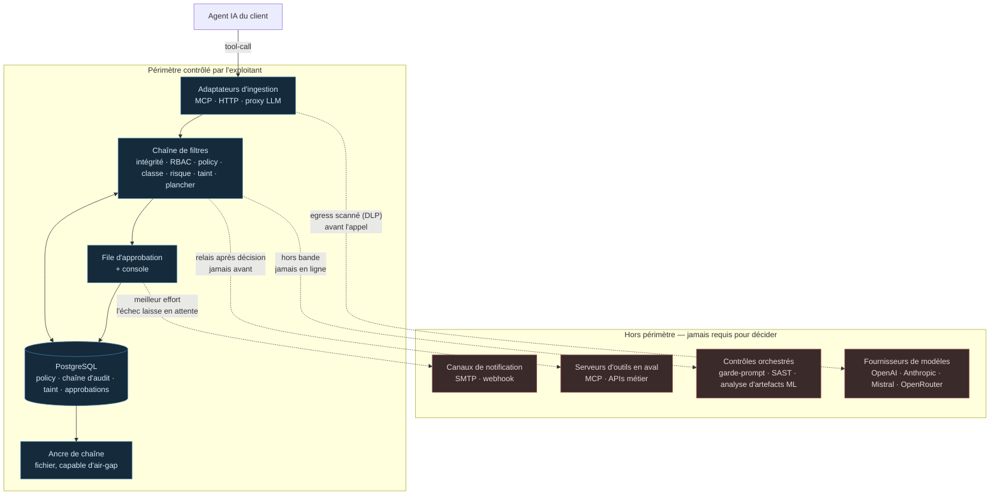

# Architecture souveraine — ce qui ne sort jamais du périmètre

> **Audience** : architecte ou RSSI qui évalue la revendication « souverain ».
> **Autorité** : `docs/product/ARCHITECTURE-V2.5.md` (`AD-25`, `AD-32`, `AD-34`) et
> `docs/product/THREAT-COVERAGE.md` §6.2. Ce document les rend lisibles ; il ne les
> modifie pas.

---

## 1. Le critère, avant le schéma

La question « êtes-vous souverain ? » se répond mal par la nationalité d'un éditeur.
Un logiciel écrit en France mais hébergé sous droit étranger ne l'est pas ; une
bibliothèque open source américaine exécutée localement sans rappel réseau ne perce
aucune chaîne.

**Le critère retenu est la dépendance opérationnelle** (`QO-3`, tranchée) :

> Une décision est-elle *prise, enregistrée et vérifiable* sans qu'aucun appel sorte
> du périmètre contrôlé par l'exploitant ?

C'est un critère testable, et il est testé : `AD-25` fait de la souveraineté une
propriété de CI, pas une promesse commerciale. La métrique associée est `SM-15` —
**appels sortants hors UE requis sur le chemin de décision : 0**.

---

## 2. Le périmètre

**La frontière n'est pas géographique.** Un hébergeur européen sous droit non
européen n'est pas une réponse. Elle est opérationnelle : rien de ce qui est hors
de la boîte n'est *requis* pour qu'une décision soit prise, écrite et vérifiée.

---

## 3. Chaque franchissement, et ce qu'il coûte s'il est coupé

| Sortie | Quand | Une décision en dépend ? | Coupée, il se passe quoi |
|---|---|---|---|
| **Serveur d'outils en aval** (relais du tool-call) | *Après* la décision d'autoriser, jamais avant | **Non** | L'action n'a pas lieu. C'est le comportement voulu : le contrôle a déjà statué. |
| **Fournisseur de modèle** (proxy LLM) | Sur le trafic que le client route par le proxy | **Non** | Le client perd l'accès au modèle, pas le contrôle. Le blocage DLP d'egress est en amont de cet appel et inconditionnel. |
| **Juge LLM** (classification des règles `ambiguous`) | Sur une règle `classify: ambiguous` uniquement | **Non** — et c'est explicite | Le juge absent contribue sa **classe d'échec** (`irreversible`), donc l'action part en approbation humaine au lieu d'être auto-autorisée (`AD-34`, `FR-198`). Le pipeline continue. |
| **Contrôles orchestrés** (garde-prompt, SAST, analyse de modèles) | Hors bande, en amont ou en aval | **Non** | La ligne de couverture correspondante retombe à son mode inférieur. Aucune ligne `Bloqué` native n'en dépend. |
| **Notification d'approbation** (SMTP, webhook) | À la création d'une approbation | **Non** | L'échec est journalisé et l'approbation **reste en attente** — donc l'action reste bloquée. L'échec penche du côté sûr. |
| **Vérification d'ancre externe** | À la demande, sur export | **Non** | La chaîne reste vérifiable localement (`verify_chain`). L'ancre externe renforce la preuve, elle ne la fonde pas. |

**Lecture.** Aucune ligne du tableau ne porte « oui ». C'est la revendication entière,
et c'est ce que `SM-15` mesure en continu.

---

## 4. Le prérequis que la souveraineté impose au client

`AD-32` : le chemin de décision n'exige **qu'un PostgreSQL contrôlé par
l'exploitant**. Pas un service managé d'un fournisseur particulier, pas une base
propriétaire, pas un second moteur de stockage (`§7.2` l'exclut).

Ce n'est pas une préférence esthétique. C'est ce qui rend le déploiement possible
chez un client dont la contrainte est « rien ne sort du SI », et c'est ce qui rend
l'air-gap atteignable : l'ancre de chaîne est un fichier.

**Le corollaire dur** : le client doit fournir un Postgres avec les privilèges de
migration. Un Postgres managé bridé — pas de `CREATE EXTENSION`, pas de rôle
propriétaire — est un blocage de déploiement, pas un détail d'installation. Il vaut
mieux le dire avant la signature qu'au premier `make migrate`.

---

## 5. Les contrôles orchestrés, et leur question de substitut

Une ligne de couverture en mode `Orchestré` signifie : *nous ne le bloquons pas
nous-mêmes, nous pilotons un contrôle tiers qui le fait, et nous en chaînons le
verdict dans l'audit.* Le tiers devient alors une dépendance — et la doctrine
s'applique à lui.

**La liste vit dans `coverage/rows.yaml` et se publie dans la carte générée**
(`coverage/COVERAGE-MAP.md`, section « Contrôles orchestrés et substituts
souverains »). Elle n'est pas recopiée ici : ce document a porté cette table en prose
jusqu'à ce que `FR-178` la rende mécanique, et deux tables qui disent la même chose
finissent par ne plus la dire (`AD-30`). Ce qui reste ici est la doctrine ; le
recensement est dérivé.

La règle qui la gouverne tient en une ligne, et elle est appliquée au parse du
registre, pas à la relecture :

> Une facette `Orchestré` nomme son substitut **et** le critère qui le rend souverain
> — `local` (s'exécute dans le périmètre, sans rappel réseau) ou `ue` (service en
> ligne sous juridiction de l'Union). Sans substitut, elle est publiée
> `Hors périmètre`.

Le vocabulaire est fermé exprès. Un champ libre laisserait écrire « conforme » et
publier `Orchestré` sur un SaaS hors UE ; `ue` est une affirmation qu'un relecteur
voit et peut contester.

**Ce que la doctrine coûte, appliquée honnêtement.** Au dernier passage, quatre
contrôles sur cinq ont un substitut — le garde-prompt et la garde de sortie anti-leak
par Mistral, que la stack impose déjà ; l'analyse d'artefacts ML et le SAST/DAST
parce qu'ils s'exécutent localement. Le cinquième, la **découverte du Shadow AI**
(`M-10`, `G-09`), passe par un CASB du marché et n'en a aucun : la facette est donc
déclassée en `Hors périmètre`. C'est une revendication retirée plutôt que tenue par un
chemin qui contredit le discours — et c'est la ligne la plus instructive du lot.

**Une cinquième ligne est apparue en outillant la règle.** Ce document n'en recensait
que quatre ; le registre en publiait cinq. `M-14 / détection de fuite du prompt sur
l'egress` était `Orchestré` sans que la question du substitut lui ait jamais été
posée. C'est une garde de sortie, donc la même famille que le garde-prompt de `M-01`,
et elle hérite du même substitut — mais personne ne l'avait établi. Une table tenue à
la main perd une ligne sans que rien ne le signale ; c'est précisément pour cela
qu'elle est dérivée maintenant.

---

## 6. Ce qui est tenu aujourd'hui, et ce qui reste à construire

`AD-25` pose que la souveraineté doit être une **propriété de CI** et non une
promesse. Elle l'est désormais : `scripts/audit_sovereignty.py` tourne à chaque build
et publie `SM-15`.

**La garantie, telle que la CI la vérifie :**

> Aucun module atteignable depuis le calcul du verdict ne peut effectuer d'appel
> sortant. Le « peut » est délibéré — la garantie vendue n'est pas « nous n'appelons
> pas », c'est « rien ne nous en donne le moyen ». C'est donc une analyse statique du
> graphe d'imports : une branche jamais prise sur le jeu de tests reste une
> dépendance.

Quatre modules sont déclarés **hors pli**, chacun avec la raison pour laquelle il
n'est pas requis pour qu'un verdict soit rendu : le juge (enrichisseur, jamais
décideur), la notification d'approbation (hors bande, son échec laisse l'action en
attente), le relais vers l'aval (l'action elle-même, après le verdict) et la garde
d'egress (elle résout un nom pour en refuser les plages, à l'enregistrement et à la
connexion). La liste est fermée : un cinquième module qui gagnerait une sortie fait
échouer le build.

**Tenu, et testé aujourd'hui :**

| Propriété | Où |
|---|---|
| Rien sur le chemin de décision ne **peut** joindre le réseau — `SM-15 = 0`, et le graphe d'imports est parcouru à chaque build | `scripts/audit_sovereignty.py`, `tests/test_sovereignty_gate.py` |
| Un verdict se rend, et une action irréversible est tenue, **toute sortie coupée** | `tests/test_sovereignty_gate.py` (harnais de blocage, avec son propre contrôle négatif) |
| Une facette `Orchestré` sans substitut souverain nommé est publiée `Hors périmètre` | `core/profiles.py` (au parse), `tests/test_sovereignty_substitutes.py` |
| Aucun nom d'hôte de l'éditeur n'est figé dans un artefact livré | `tests/test_no_vendor_hosts.py` (fichiers *suivis*, pas le worktree) |
| Le juge absent ou hors budget rend le pipeline **plus strict**, jamais plus permissif | `core/judge.py` `resolve_ambiguous`, `tests/test_judge.py` |
| Le blocage DLP d'egress précède l'appel fournisseur et la branche streaming | `api/llm_proxy.py` `_forward`, `tests/test_llm_proxy.py` |
| Toute sortie passe par une aide unique qui interroge la portée visée | `core/egress.py` (`AD-24`), `tests/test_egress.py` |
| La chaîne d'audit se vérifie localement, sans dépendance externe | `scripts/verify_chain.py` |
| Une notification d'approbation qui échoue laisse l'action **en attente** | `core/decision.py` `_notify` |
| La carte de couverture est générée depuis les scénarios qui passent | `scripts/gen_coverage.py` (`AD-30`, `G-18`) |

**Ce qui reste ouvert, et pourquoi :**

| Reste | État |
|---|---|
| L'analyse statique voit les sockets **Python**. Une sortie ouverte depuis une extension native (`libpq` ouvre les siens en C) échappe au harnais d'exécution | Couvert par l'analyse statique, qui juge l'import ; c'est la raison pour laquelle les deux moitiés existent |
| L'ancre de chaîne capable d'air-gap n'a ni signataire ni clé hors base | `FR-169` première moitié — non implémentable tant qu'aucun signataire de checkpoint n'existe |
| La découverte du Shadow AI n'a aucun substitut souverain | Déclassée par `FR-178` plutôt que revendiquée |

---

## 7. Ce que ce document ne prétend pas

- Il ne dit pas que le produit est certifié SecNumCloud. Il dit où sont les
  dépendances, et lesquelles sont nulles sur le chemin de décision.
- Il ne dit pas que le client n'a aucune dépendance non européenne — son fournisseur
  de modèle en est probablement une. Il dit que **la couche de contrôle** n'en ajoute
  aucune.
- Il ne dit pas que **la console** fonctionne hors ligne. Elle vérifie un JWT contre
  le JWKS de l'IdP configuré, ce qui est un appel sortant. L'IdP est un réglage et
  aucun nom d'hôte d'éditeur n'est figé dans un artefact livré (`test_no_vendor_hosts`),
  donc un exploitant qui héberge son Supabase reste dans son périmètre — mais c'est
  son choix de déploiement, pas une propriété que nous vérifions. Ce que la CI vérifie
  est plus étroit et plus fort : **rendre un verdict** ne demande rien d'autre que
  Postgres.
- Il ne dit pas que le harnais d'exécution voit tout : il voit les sockets Python.
  C'est l'analyse statique qui couvre le reste, et les deux moitiés sont nécessaires.
- `G-17` et `G-21` sont clos par `FR-176`/`FR-177`/`FR-178` : chaque contrôle
  orchestré nomme son substitut ou se déclasse, et le fonctionnement hors ligne est
  vérifié à chaque build plutôt qu'affirmé. Ce qui les rendait ouverts n'était pas
  l'absence de doctrine — elle était écrite ici — mais l'absence d'un instrument qui
  la contredise quand elle cesse d'être vraie.
