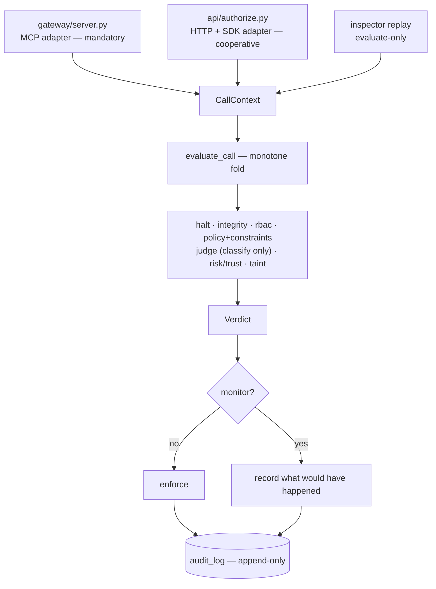
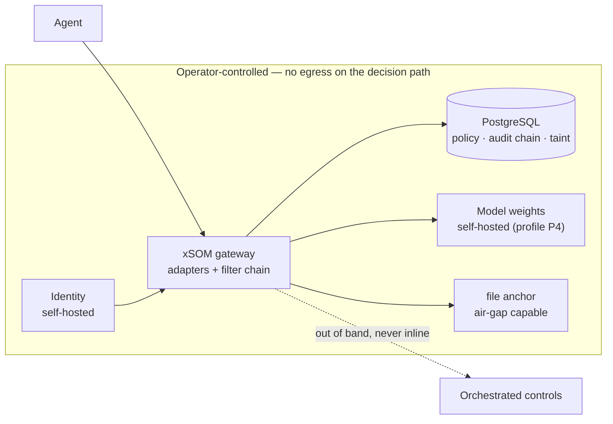

# Architecture Spine — xSOM AI Guard v2.5

## Design Paradigm

**Ports-and-adapters at the edge; a monotone filter chain at the core.**

Every ingress path is an adapter. It authenticates, derives what only it can know, builds a `CallContext`, and calls one evaluator. It never decides.

The core is a chain of filters over that context. Each filter returns a **minimum** approval tier — never a verdict. The chain folds by `max` over the tier order, so a filter can only ever tighten. This is what makes "no guard weakens another" a property of the shape rather than a convention someone must remember.

| Layer | Lives in |
| --- | --- |
| Adapters (ingress) | `gateway/` (MCP, mandatory) · `api/` (HTTP/SDK, cooperative) |
| Filter chain + verdict | `core/` |
| Evidence | `core/audit.py` and the append-only chain |

---

## Inherited Invariants

Binding and read-only. Original ids from `ARCHITECTURE-V2.md`; never renumbered, never re-derived here.

| Inherited | Binds here |
| --- | --- |
| **AD-1** — new audit fields go to annex columns; Payload v1 and `compute_entry_hash` are frozen | Every field `FR-160`/`FR-161` add |
| **AD-4** — one pipeline, both paths call it; the root cause is duplication, not omission | `AD-21` fixes only the fold mechanic AD-4 left open |
| **AD-6** — external Postgres, one storage engine | `AD-32` amends it with the privilege prerequisite |
| **AD-8** — checkpoint signature and key custody | `FR-169` |
| **AD-10** — taint lives in a Postgres table with RLS; unresolvable session is tainted, never clean; a read failure denies `irreversible`/`external_send` | **Amended by `FR-154`**: AD-10 fixes the location, not the key |
| **AD-15** — erasure never touches the chain | `FR-163` |
| **AD-16** — where the decision reason lives | `FR-160`, `FR-161` |
| **AD-20** — evaluate-only replay executes nothing | `AD-26`, `AD-29` |
| §7.2 exclusions — no second storage engine, no ORM, no ML, no LLM near a verdict | All of `FR-153..197` |

---

## Invariants & Rules

### Dependency direction



Adapters depend on the core. The core never depends on an adapter, and no filter depends on another.

### AD-21 — Guard composition is monotone by construction

- **Binds:** every filter, `evaluate_call`, `FR-153`..`FR-159`, `FR-170`
- **Prevents:** a future filter lowering an earlier verdict. The inherited AD-4 relies on a golden-decision corpus, which `INV-13` shows proves only that today's inputs give today's outputs.
- **Rule:** a filter returns a *minimum* approval tier, never a final verdict. `evaluate_call` folds results with `max` over the tier order. A property test asserts the final tier is ≥ every intermediate tier for any context and any filter sequence, and that `irreversible` and `external_send` never resolve to `auto` or `notify` regardless of trust streak, band configuration or enforcement mode.

### AD-22 — The ingress adapter owns derived identity

- **Binds:** every adapter, every audit write, `FR-160`, `FR-161`
- **Prevents:** the supervised party authoring the fields that describe how strongly it was supervised
- **Rule:** `enforcement_mode`, `tenant_id` and `gateway_token_id` are set by the adapter from authenticated state. A caller supplying any of them gets a 422, never a silent ignore. Every other caller-supplied field is stored under a `declared` namespace and rendered as declared in exports and the console.

### AD-23 — One constraint vocabulary, one evaluator

- **Binds:** policy parser, every filter reading a constraint, `FR-155`, `FR-157`, `FR-158`
- **Prevents:** the live split — `allowed_clients` evaluated in the gateway, `allowed_domains` in `core/policy.py` — which is what produces the fail-open, not a symptom of it
- **Rule:** constraints and argument predicates are one closed, versioned, typed vocabulary, evaluated in one place. An unrecognised key fails the document at parse time with the key named. A referenced field that is absent or mistyped evaluates closed. The vocabulary is non-Turing-complete so replay and simulation stay deterministic.

### AD-24 — One outbound path for tenant-supplied URLs

- **Binds:** sinks, notification channels, anchor targets, `FR-164`
- **Prevents:** SSRF reintroduced feature by feature
- **Rule:** every fetch of a tenant-supplied URL goes through one helper — scheme allowlist, resolve then reject loopback / link-local / private / ULA ranges, Host pinned to the resolved address, no redirect following, bounded size and timeout, body never returned to the tenant.

### AD-25 — Sovereignty is a CI property, not a promise

- **Binds:** every module reachable from `evaluate_call`, `FR-176`
- **Prevents:** a later feature quietly introducing a non-EU dependency on the decision path
- **Rule:** the decision path completes with **no network egress**. A test fails if any module reachable from `evaluate_call` can reach a host outside the declared set. Orchestrated controls run out of band, never inline in a decision.

### AD-26 — Scenarios assert; videos render

- **Binds:** every claimed `Blocked` line, the demonstration library, `FR-181`
- **Prevents:** a published claim drifting from behaviour without anyone noticing
- **Rule:** a scenario is an executable that asserts both that the defence held **and** that the downstream was never invoked, and exits non-zero otherwise. CI runs every scenario. A video is a recording of a passing run, never a substitute for one.

### AD-27 — Monitor mode is one branch at the fold

- **Binds:** `evaluate_call`, every adapter, `FR-179`, `FR-180`
- **Prevents:** monitor semantics differing per ingress path
- **Rule:** monitor is a property of the context, applied once at the decision boundary after the fold. No adapter implements its own. Monitor entries carry the mode and are excluded from oversight evidence.

### AD-28 — Coverage claims carry their ingress path

- **Binds:** the published map, sales material, Evidence Packs, `FR-175`
- **Prevents:** a claim true on MCP being read as true everywhere — the live state, where three filters are absent from the HTTP path
- **Rule:** every coverage row states the path on which it holds. A row without a path is invalid.

### AD-29 — The decision path is provable headless

- **Binds:** scenarios, CI, `FR-181`, `FR-195`
- **Prevents:** the strata blocked behind the identity and deployment plane, whose eleven known defects do not touch a decision
- **Rule:** no scenario requires the console, the identity service, or a network. A database and the gateway suffice, as `scripts/demo.py` already demonstrates.

### AD-30 — The coverage map is generated, never authored

- **Binds:** `FR-173`, the published map, `CM-7`
- **Prevents:** any claim that no passing test backs
- **Rule:** the map is emitted from scenario results. A `Blocked` row exists only if its scenario passed on the current commit. Hand-editing the map is not a supported operation.

### AD-31 — The demo tenant is a committed deterministic seed

- **Binds:** `FR-182`, `FR-183`
- **Prevents:** real third-party personal data reaching a public artefact of a product sold on data governance
- **Rule:** the demo tenant ships as reviewable fixtures in the repository, not as generator output, so "no third-party personal data" is verified by reading the diff. A CI check fails on any seed value matching a real-PII shape.

### AD-32 — The decision path requires only operator-controlled Postgres

- **Binds:** deployment envelope, `FR-195`, profile P4
- **Prevents:** an install believing itself sound on a provider where tenant isolation does not actually apply
- **Rule:** privileges the decision path depends on are asserted at startup and fail loudly. Where a managed provider cannot grant them, they are named DBA prerequisites, never assumptions. Amends inherited **AD-6**.

---

## Consistency Conventions

| Concern | Convention |
| --- | --- |
| Filter interface | One signature: context in, *minimum tier* out. A filter never returns a final verdict, never executes, never calls a model. |
| Derived vs declared | Server-derived fields are unqualified; everything caller-supplied lives under `declared` and renders as declared. |
| Failure direction | Every filter declares its failure verdict, and it is always at least as tight as its success verdict. |
| Constraint keys | Closed vocabulary, versioned with the policy document. Unknown key rejects the document; it never degrades to allow. |
| Outbound calls | Only through the egress helper. A direct `httpx` call to a tenant-supplied URL is a review failure. |
| Scenario naming | One scenario per coverage row, named for the row it proves, so the generated map and the suite cannot drift apart. |
| New requirement ids | Continue the sequence: `FR-153+`, `AD-21+`. Never renumber, never reuse. |

---

## Stack

Inherited unchanged from `ARCHITECTURE-V2.md` §6. The strata adds **no required runtime dependency**; every decision above is expressible with what is already pinned.

| Name | Version |
| --- | --- |
| Python | 3.12 |
| PostgreSQL | 16 |
| Judge model provider | Mistral, via LiteLLM (`CLAUDE.md` §3) |

---

## Structural Seed

### Sovereign deployment envelope



The boundary is not a datacentre location — an EU host under non-EU law is not an answer. It is operational: nothing outside the box is required for a decision to be taken, recorded and verified. `AD-25` makes that testable.

### Where the strata lands

```text
core/
  pipeline.py      # the fold — AD-21, AD-27
  provenance.py    # declared vs derived — AD-22
  constraints.py   # one vocabulary, one evaluator — AD-23
  egress.py        # the single outbound helper — AD-24
gateway/           # MCP adapter — builds CallContext, never decides
api/               # HTTP + SDK adapter — same
scenarios/         # one per coverage row — AD-26, AD-30
  fixtures/        # committed demo seed — AD-31
```

---

## Capability → Architecture Map

| Requirement group | Lives in | Governed by |
| --- | --- | --- |
| `FR-153`..`FR-159` — enforcement core | `core/pipeline.py`, `core/constraints.py`, taint | `AD-21`, `AD-23`, amended `AD-10` |
| `FR-160`..`FR-171` — evidence integrity | adapters, `core/provenance.py`, migrations | `AD-22`, `AD-24`, `AD-32`, inherited `AD-1` |
| `FR-172`..`FR-175` — triage | generated map, published artefacts | `AD-28`, `AD-30` |
| `FR-176`..`FR-178` — sovereignty | decision path, CI | `AD-25` |
| `FR-179`..`FR-183` — demonstrator | `core/pipeline.py`, `scenarios/` | `AD-26`, `AD-27`, `AD-29`, `AD-31` |
| `FR-184`..`FR-194` — remaining coverage | filters, registry | `AD-21`, `AD-23` |
| `FR-195`..`FR-197` — deployment, identity, positioning | deployment envelope, docs | `AD-29`, `AD-32` |

---

## Deferred

| Deferred | Why it can wait |
| --- | --- |
| **Extraction amplitude** — minimal fold versus the full `core/pipeline.py` + `core/provenance.py` of ARCHITECTURE-V2 §2.C.1 | Both satisfy `AD-21`. The lean is minimal-designed-for-full, so the choice changes sequencing, not shape. Awaiting ratification. |
| **Where the usage-profile model lives** (`FR-172`) — tenant attribute versus consulting artefact | Depends on `QO-7`, which is a commercial question. The two answers produce different architectures; deciding it here would be guessing. |
| **NIS2 / DORA / ANSSI mapping** | `AR-1` defers them pending review by a practising assessor. The declarative mapping table already makes adding them cheap. |
| **LLM proxy separability** (`AR-2`, `QO-8`) | Whether DLP enforcement survives demoting the proxy is an implementation question. It changes one coverage row, not the spine. |
| **Demo tenant domain** (`QO-9`) | `AD-31` fixes the form — committed, deterministic, PII-checked. The subject matter is a narrative choice. |
| **Story-level detail** | This spine is initiative altitude. It fixes what epics must share and deliberately stops there. |
