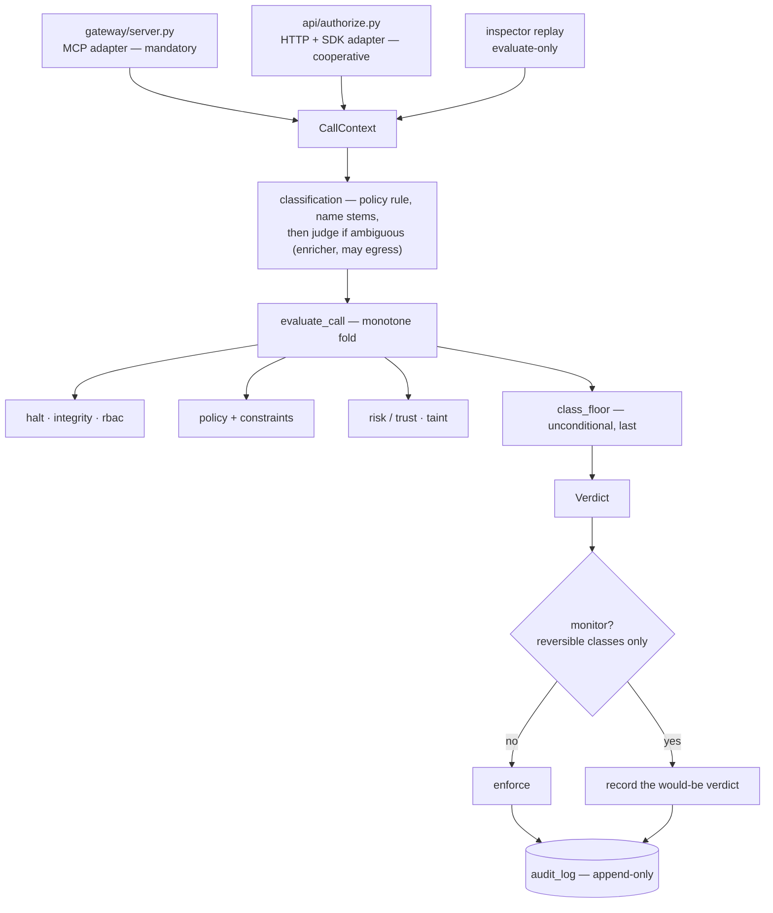
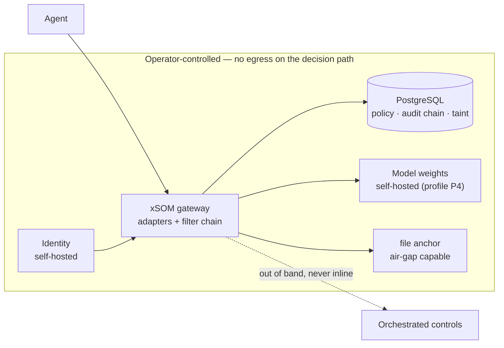

# Architecture Spine — xSOM AI Guard v2.5

## Design Paradigm

**Ports-and-adapters at the edge; a monotone filter chain at the core.**

Every ingress path is an adapter. It authenticates, derives what only it can know, builds a `CallContext`, and calls one evaluator. It never decides.

The core is a chain of filters over that context. Each filter returns a **minimum** approval tier — never a verdict. The chain folds by `max` over the tier order, so a filter can only ever tighten. This is what makes "no guard weakens another" a property of the shape rather than a convention someone must remember.

Two things a `max`-fold cannot do on its own, and which the paradigm therefore names separately:

- **It cannot inject a value no filter produced.** The class floor is not foldable, so it is a named step of the chain, not an emergent property of it (`AD-21`).
- **It is order-independent, but its inputs are not.** Filters read fields other filters produce, so the chain is a **declared partial order**, not a set (`AD-33`).

**The judge is not a filter.** It produces `action_class`; it never returns a tier and never decides. It runs *before* the fold as a classification enricher, which is why the "a filter never calls a model" convention and the no-egress rule (`AD-25`) hold without excluding it.

| Layer | Lives in |
| --- | --- |
| Adapters (ingress) | `gateway/` (MCP, mandatory) · `api/` (HTTP/SDK, cooperative) |
| Filter chain + verdict | `core/` |
| Evidence | `core/audit.py` and the append-only chain |

---

## Inherited Invariants

Binding and read-only. Original ids from `ARCHITECTURE-V2.md`; never renumbered, never re-derived here.

| Inherited | Binds here |
| --- | --- |
| **AD-1** — new audit fields go to annex columns; Payload v1 and `compute_entry_hash` are frozen | Every field `FR-160`/`FR-161` add |
| **AD-4** — one pipeline, both paths call it; the root cause is duplication, not omission | `AD-21` fixes only the fold mechanic AD-4 left open |
| **AD-6** — external Postgres, one storage engine | `AD-32` amends it with the privilege prerequisite |
| **AD-8** — checkpoint signature and key custody | `FR-169` |
| **AD-10** — taint lives in a Postgres table with RLS; unresolvable session is tainted, never clean; a read failure denies `irreversible`/`external_send` | **Amended by `FR-154`**: AD-10 fixes the location, not the key |
| **AD-15** — erasure never touches the chain | `FR-163` |
| **AD-16** — where the decision reason lives | `FR-160`, `FR-161` |
| **AD-20** — evaluate-only replay executes nothing | `AD-26`, `AD-29` |
| §7.2 exclusions — no second storage engine, no ORM, no ML, no LLM near a verdict | All of `FR-153..199` |

---

## Invariants & Rules

### Dependency direction



Adapters depend on the core; the core never depends on an adapter. Filters **do** depend on each other — the chain is a declared partial order (`AD-33`), not a set.

### AD-21 — Guard composition is monotone, and the class floor is a named step

- **Binds:** every filter, `evaluate_call`, `FR-153`..`FR-159`, `FR-170`
- **Prevents:** a future filter lowering an earlier verdict. The inherited AD-4 relies on a golden-decision corpus, which `INV-13` shows proves only that today's inputs give today's outputs.
- **Rule:**
  1. A filter returns a *minimum* approval tier, never a final verdict. `evaluate_call` folds results with `max` over the tier order.
  2. **A `max`-fold cannot inject a value no filter produced**, so the class floor is a **named, unconditional step ordered last**, after policy, judge and every other filter. `ToolRule` does not constrain `approval` against `action_class` (`core/policy.py:98-113`), so `class: irreversible, approval: auto` parses today; the floor exists to make that document safe rather than to forbid it. The floor covers `irreversible` **and** `external_send`, and is not conditioned on `risk_bands` being configured.
  3. **Tie-break:** where several filters return the same maximal tier, the **earliest in the declared order** owns `decision_reason` and `escalated_by`. `guards_run` records the full executed set regardless.
  4. `judge_used` means *a model call was made* — not *the rule was ambiguous*.
- **Property test:** the final tier is ≥ every intermediate tier, for the declared order; and `irreversible`/`external_send` never resolve to `auto` or `notify` regardless of trust streak, band configuration, enforcement mode, or a policy declaring otherwise.

### AD-22 — The ingress adapter owns derived identity

- **Binds:** every adapter, every audit write, `FR-160`, `FR-161`
- **Prevents:** the supervised party authoring the fields that describe how strongly it was supervised
- **Rule:**
  1. `enforcement_mode`, `tenant_id` and `gateway_token_id` are set by the adapter from authenticated state. A caller supplying any of them is **rejected with a client error naming the field** — stated transport-neutrally, because stdio MCP has no request body distinct from the tool's own arguments.
  2. **Tool `arguments` are never a context source.** They are downstream payload and are hashed as such.
  3. Every `CallContext` field is classified in a published table as `derived`, `declared`, or `derived-from-declared` with its derivation named — thirteen fields, not the three above. `session_id` is declared but its taint key is derived (`FR-154`); `trace_id` is caller-supplied and therefore moves under `declared`, which **amends inherited AD-1's annex contract** and is declared as such here rather than silently.
  4. `declared` has one physical shape, fixed once before any migration ships, since applied migrations are immutable and the standalone verifier must rebuild exports byte-for-byte.

### AD-23 — One constraint vocabulary, one evaluator

- **Binds:** policy parser, every filter reading a constraint, `FR-155`, `FR-157`, `FR-158`
- **Prevents:** the live split — `allowed_clients` evaluated in the gateway, `allowed_domains` in `core/policy.py` — which is what produces the fail-open, not a symptom of it
- **Rule:** constraints and argument predicates are one closed, versioned, typed vocabulary, evaluated in one place. An unrecognised key fails the document at parse time with the key named. A referenced field that is absent or mistyped evaluates closed. The vocabulary is non-Turing-complete so replay and simulation stay deterministic.

### AD-24 — Two scopes for tenant-supplied URLs, both covered

- **Binds:** sinks, notification channels, anchor targets, **and `gateway/downstream.py`**, `FR-164`
- **Prevents:** SSRF reintroduced feature by feature — and the largest surface being read as out of scope because the rule was written for the smallest
- **Rule, scope 1 — URLs xSOM fetches on the tenant's behalf** (sinks, channels, anchors): one helper — scheme allowlist, resolve then reject loopback / link-local / private / ULA ranges, Host pinned to the resolved address, no redirect following, bounded size and timeout, **body never returned to the tenant**.
- **Rule, scope 2 — endpoints the tenant registers for relay** (`ServerSpec.config["url"]`, `gateway/downstream.py:53-58`): allowlist and range-check at **registration**, re-resolve and pin at connect, no redirect following. The body **is** the tool result and is returned — that is the product's function, so scope 1's last clause does not apply here and must not be read onto it.

### AD-25 — Sovereignty is a CI property, not a promise

- **Binds:** every module reachable from `evaluate_call`, `FR-176`
- **Prevents:** a later feature quietly introducing a non-EU dependency on the decision path
- **Rule:** the fold completes with **no network egress**. A test fails if any module reachable from `evaluate_call` performs or can perform an outbound call. Orchestrated controls run out of band, never inline in a decision.
- **The judge is the one declared exception, and it sits outside the fold.** It enriches classification before `evaluate_call`; it never returns a tier. A sovereign deployment either runs it on self-hosted weights (profile P4, no egress at all) or leaves it unconfigured — and `AD-34` makes that safe. `FR-176`'s offline claim reads: *the decision path is offline-capable; the judge is an optional enricher, never a decider.*

### AD-26 — Scenarios assert; videos render

- **Binds:** every claimed `Blocked` line, the demonstration library, `FR-181`
- **Prevents:** a published claim drifting from behaviour without anyone noticing
- **Rule:** a scenario is an executable that asserts both that the defence held **and** that the downstream was never invoked, and exits non-zero otherwise. CI runs every scenario. A video is a recording of a passing run, never a substitute for one.

### AD-27 — Monitor mode is one branch at the fold, and it never covers the irreversible

- **Binds:** `evaluate_call`, every adapter, `FR-179`, `FR-180`
- **Prevents:** monitor semantics differing per ingress path — and, more seriously, monitor becoming a documented bypass of `CLAUDE.md §4.1`, which admits no exception
- **Rule:**
  1. Monitor is a property of the context, applied once at the decision boundary after the fold. No adapter implements its own.
  2. **Monitor never applies to `irreversible` or `external_send` on the mandatory path.** Those classes block in every mode. `FR-180`'s promotion report states this bound rather than reporting an incomplete count as if it were whole.
  3. A monitor entry is distinguishable **inside the hashed payload**, not only in the annex — otherwise "we blocked it" and "we would have blocked it" hash identically and the standalone verifier cannot tell them apart.
  4. Monitor entries are excluded from oversight evidence, as cooperative entries already are.

### AD-28 — Coverage claims carry their ingress path

- **Binds:** the published map, sales material, Evidence Packs, `FR-175`
- **Prevents:** a claim true on MCP being read as true everywhere — the live state, where three filters are absent from the HTTP path
- **Rule:** every coverage row states the path on which it holds. A row without a path is invalid; non-runtime modes (`Attested`, `Out of scope`) carry `n/a`, which is a value, not an omission.

### AD-29 — The decision path is provable headless

- **Binds:** scenarios, CI, `FR-181`, `FR-195`
- **Prevents:** the strata blocked behind the identity and deployment plane, whose eleven known defects do not touch a decision
- **Rule:** no scenario requires the console, the identity service, or a network. A database and the gateway suffice, as `scripts/demo.py` already demonstrates.

### AD-30 — The coverage map is generated for every mode, never authored

- **Binds:** `FR-173`, the published map, `CM-7`
- **Prevents:** any claim that no passing check backs — and the map quietly becoming half-authored because only one of five modes had a rule
- **Rule:**
  1. Every mode has a machine-checkable source, so the whole map is generated: **Blocked** and **Detected** require a passing scenario; **Orchestrated** and **Attested** require a named evidence artefact the generator reads (a registry-completeness gate, an Evidence Pack section id); **Out of scope** requires a declared reason. Hand-editing is not a supported operation for any row.
  2. A scenario that does not pass **fails the build**. A row is never silently dropped — no retry, no quarantine tier.
  3. Every `Blocked` scenario ships a **negative control**: with the guard disabled, the same script must observe the downstream *being invoked*, and fails if it does not. Without it, a passing run proves only that nothing happened — a crash, an unreachable downstream or a misspelt tool name satisfies "the defence held and the downstream was not invoked".

### AD-31 — The demo tenant is a committed deterministic seed

- **Binds:** `FR-182`, `FR-183`
- **Prevents:** real third-party personal data reaching a public artefact of a product sold on data governance
- **Rule:** the demo tenant ships as reviewable fixtures in the repository, not as generator output, so "no third-party personal data" is verified by reading the diff. A CI check fails on any seed value matching a real-PII shape.

### AD-32 — The decision path requires only operator-controlled Postgres

- **Binds:** deployment envelope, `FR-195`, profile P4
- **Prevents:** an install believing itself sound on a provider where tenant isolation does not actually apply
- **Rule:** the privileges the decision path depends on are **enumerated** — the service role's RLS bypass, advisory-lock capability, trigger creation, `information_schema` read — and asserted at startup. A failed assertion **refuses to serve traffic**, in every environment; it is never downgraded to a warning. "Named DBA prerequisite" governs the *install instructions*, never the *runtime check*. Amends inherited **AD-6**.

### AD-33 — The chain is a declared partial order

- **Binds:** every filter, `evaluate_call`, the property test of `AD-21`
- **Prevents:** two teams ordering the chain differently, both passing `AD-21`'s property test — `max` is commutative, so the fold is order-independent while the filters' *inputs* are not
- **Rule:** the chain publishes its order. `policy` and the judge produce `action_class`; every class-conditional filter runs after them; `class_floor` runs last. A filter must not read a field no earlier step wrote; where it may legitimately be absent, the absent value has a defined tier — an absent `action_class` is treated as `irreversible` for floor purposes. `AD-21`'s property test quantifies over the declared order, not over arbitrary sequences.

### AD-34 — An unconfigured dependency contributes its failure tier

- **Binds:** every filter and enricher with an optional dependency, `FR-153`..`FR-159`
- **Prevents:** the live fail-open where an absent judge silently honours a rule's declared approval. `.env.example` already promises the opposite — *"empty `MISTRAL_API_KEY` … ambiguous tools are treated as irreversible"* — while `core/policy.py:295` returns the declared approval with `action_class=None` and the escalation is skipped by `judge is not None`.
- **Rule:** *absent* is not *inert*. A step whose dependency is not configured contributes its **failure** tier, never `auto`. With no judge, an `ambiguous` rule floors to `irreversible`. This makes the code match the shipped documentation rather than the reverse.

### AD-35 — Every path runs the full chain; a missing input is a declared capability gap

- **Binds:** every adapter, `AD-28`, `FR-160`
- **Prevents:** the live state — `integrity`, `rbac` and `taint` absent from the HTTP path (`core/decision.py:21`) — being reproduced the next time an adapter is added
- **Rule:** every ingress path runs the full declared chain. A filter whose input the path cannot supply is a **capability gap**: declared in the chain contract with a named tier (never `auto`), and enumerated in `guards_run` as `unavailable` rather than silently omitted. Post-call state mutation (marking taint from a tool result) is an explicit non-filter stage owned by the adapter that executes; a path that does not execute declares it a capability gap.

### AD-36 — The constraint vocabulary is a registry with a CI gate

- **Binds:** `AD-23`, the policy parser, every filter reading a constraint
- **Prevents:** two teams adding the same key with different units or semantics — both typed, both parsing, both versioned, and off by a factor of a hundred
- **Rule:** the vocabulary is one committed registry file: `id · type · unit · evaluating filter · failure direction · introduced-in version`. CI fails on a duplicate id, a missing unit, or a key referenced in code but absent from the registry. Adding a key is a diff to that file plus a `constraints_version` bump. A policy that fails to parse makes the tenant's effective policy **deny-all** and raises a control-plane event — never last-known-good.

### AD-37 — Extraction is incremental, and every step is already chain-shaped

- **Binds:** `AD-4`, `AD-21`, `AD-33`, `AD-35`, every shared behaviour added to `core/`
- **Prevents:** the two failure modes of the same choice. A big-bang `core/pipeline.py` rewrite competes with feature work and stalls half-done, leaving both adapters live and divergent — the very state `AD-4` exists to end. A drift of ad-hoc shared helpers converges on nothing and reproduces the duplication one function lower.
- **Rule:**
  1. Extraction proceeds **one shared step at a time**, and a step is extracted when a *concrete* second caller exists — never speculatively.
  2. Each step is written to the chain's obligations **while it still has one caller**: it takes only what a `CallContext` would give it, returns a minimum tier or a classification enrichment (never a final verdict), and declares its failure direction per `AD-34`.
  3. Any new behaviour shared by both adapters lands **in a step, never in a second copy**. A duplicated block across `gateway/` and `api/` is a review failure from here on.
  4. The extraction is **done** when `core/pipeline.py` holds the declared order of `AD-33` and both adapters call only it. Until then the fold is implicit in the adapters, which is why `AD-35` (every path runs the full chain) is asserted by scenarios rather than by shape.
- **Reference shape:** `resolve_ambiguous` (`core/judge.py`) is step one. It was extracted because both adapters held the same eleven lines of judge handling; it declares its failure class (`irreversible`) rather than inheriting an absent dependency's silence, which is `AD-34` made concrete.
- **Ratifies** the *minimal-designed-for-full* amplitude the spine had left open.

### AD-38 — Un artefact de conformité énonce la portée de ce qu'il prouve

- **Binds:** `core/compliance.py`, `core/export.py`, l'Evidence Pack JSON et PDF, `FR-169`, `FR-175`, hérite d'`AD-28`
- **Prevents:** la forme la plus coûteuse du contrôle décoratif — celle qui sort du produit. Un pack remis à un régulateur avec `tamper_evident: true` répond à « la chaîne est-elle cohérente » pendant que le lecteur pose « l'exploitant l'a-t-il réécrite ». Et un récit dont les quatre nombres ne totalisent pas l'effectif annoncé fait disparaître, silencieusement, la catégorie la plus intéressante pour un auditeur : les actions laissées passer sous fenêtre d'observation.
- **Rule:**
  1. Un résumé de décisions est une **partition** : tout ce qui est compté dans le total est compté dans un seau. Une décision inconnue tombe dans `unclassified`, est publiée et est **nommée dans le récit** — jamais omise.
  2. `monitor_*` n'est pas « autorisé ». Une action laissée passer sous fenêtre d'observation a son propre seau, dans le pack comme dans la prose.
  3. Une vérification déclare **par qui** elle a été faite. Tant qu'aucun témoin externe n'est configuré, le pack porte `independent: false` — calculé, pas rédigé, pour que la construction d'un signataire oblige à modifier la fonction plutôt qu'à se souvenir d'une phrase.
  4. Une garantie qui ne vaut pas également sur les trois chemins d'entrée est **portée en champ structuré**, pas seulement en prose : un narrateur LLM peut réécrire une phrase, il ne réécrit pas `article_14.scope`.
  5. Le PDF porte les mêmes réserves que le JSON. C'est l'exemplaire qui est remis.
- **Reference shape:** `export.summarise` et `compliance.verification_independence`. Le premier a une propriété testable — la somme des seaux égale la somme des décisions — vérifiée contre le vocabulaire complet que le code écrit ; le second n'a rien à valider parce qu'il n'y a rien à saisir.

---

## Consistency Conventions

| Concern | Convention |
| --- | --- |
| Filter interface | One signature: context in, *minimum tier* out. A filter never returns a final verdict, never executes, never calls a model. |
| Derived vs declared | Server-derived fields are unqualified; everything caller-supplied lives under `declared` and renders as declared. |
| Failure direction | Every filter declares its failure verdict, and it is always at least as tight as its success verdict. |
| Constraint keys | Closed vocabulary, versioned with the policy document. Unknown key rejects the document; it never degrades to allow. |
| Outbound calls | Only through the egress helper. A direct `httpx` call to a tenant-supplied URL is a review failure. |
| Scenario naming | One scenario per coverage row, named for the row it proves, so the generated map and the suite cannot drift apart. |
| New requirement ids | Continue the sequence: `FR-153+`, `AD-21+`. Never renumber, never reuse. |

---

## Stack

Inherited unchanged from `ARCHITECTURE-V2.md` §6. The strata adds **no required runtime dependency**; every decision above is expressible with what is already pinned.

| Name | Version |
| --- | --- |
| Python | 3.12 |
| PostgreSQL | 16 |
| Judge model provider | Mistral, via LiteLLM (`CLAUDE.md` §3) |

---

## Structural Seed

### Sovereign deployment envelope



The boundary is not a datacentre location — an EU host under non-EU law is not an answer. It is operational: nothing outside the box is required for a decision to be taken, recorded and verified. `AD-25` makes that testable.

### Where the strata lands

```text
core/
  pipeline.py          # the fold, the declared order, the class floor — AD-21, AD-27, AD-33
  provenance.py        # declared vs derived, the field table — AD-22
  constraints.py       # one evaluator — AD-23
  constraints_registry.yaml  # the key registry, CI-gated — AD-36
  egress.py            # outbound helper, scope 1 — AD-24
gateway/               # MCP adapter — builds CallContext, never decides
  downstream.py        # registered endpoints, scope 2 — AD-24
api/                   # HTTP + SDK adapter — same contract, full chain — AD-35
scenarios/             # one per coverage row, each with its negative control — AD-26, AD-30
  fixtures/            # committed demo seed, PII-shape gated — AD-31
```

---

## Capability → Architecture Map

| Requirement group | Lives in | Governed by |
| --- | --- | --- |
| `FR-153`..`FR-159` — enforcement core | `core/pipeline.py`, `core/constraints.py`, taint | `AD-21`, `AD-23`, `AD-33`, `AD-34`, `AD-36`, amended `AD-10` |
| `FR-160`..`FR-171` — evidence integrity | adapters, `core/egress.py`, migrations `0019`/`0020` | `AD-22`, `AD-24`, `AD-32`, `AD-35`, `AD-38`, inherited `AD-1` |
| ↳ `FR-160`, `161`, `162`, `164`, `169` (partiel) | **livrées** — `audit.Origin`, colonnes `declared`, garde RLS, `core/egress.py`, bloc `verification` | `AD-38`, `AD-1`, `AD-24`, `AD-28` |
| `FR-172`..`FR-175` — triage | **livrées** — `core/profiles.py`, `core/triage.py`, `xsom triage`, carte bidimensionnelle | `AD-28`, `AD-30`, `AD-38` |
| `FR-176`..`FR-178` — sovereignty | decision path, CI | `AD-25`, `AD-34` |
| `FR-179`..`FR-183` — demonstrator | `core/pipeline.py`, `scenarios/` | `AD-26`, `AD-27`, `AD-29`, `AD-30`, `AD-31` |
| `FR-184`..`FR-194` — remaining coverage | filters, registry | `AD-21`, `AD-23`, `AD-35`, `AD-36` |
| `FR-195`..`FR-197` — deployment, identity, positioning | deployment envelope, docs | `AD-29`, `AD-32` |
| `FR-198`, `FR-199` — defects the review surfaced | policy engine (**shipped**) | `AD-34`, `AD-23`, `AD-37` |

---

## Deferred

| Deferred | Why it can wait |
| --- | --- |
| **Where the usage-profile model lives** (`FR-172`) — tenant attribute versus consulting artefact | Depends on `QO-7`, which is a commercial question. The two answers produce different architectures; deciding it here would be guessing. |
| **NIS2 / DORA / ANSSI mapping** | `AR-1` defers them pending review by a practising assessor. The declarative mapping table already makes adding them cheap. |
| **Demo tenant domain** (`QO-9`) | `AD-31` fixes the form — committed, deterministic, PII-checked. The subject matter is a narrative choice. |
| **Story-level detail** | This spine is initiative altitude. It fixes what epics must share and deliberately stops there. |
