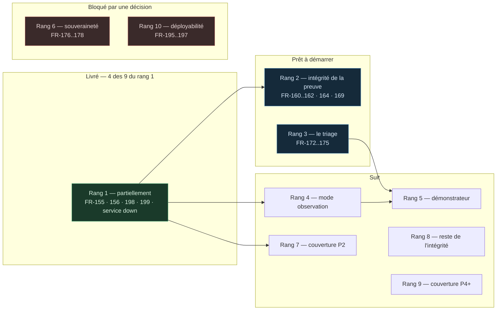

# Découpage du travail — ce qui se construit, dans quel ordre, et ce qui bloque quoi

> **Audience** : l'équipe qui construit, et quiconque doit arbitrer un retard.
> **Autorité** : la PRD §5 pour les rangs, `ARCHITECTURE-V2.5.md` pour les décisions,
> `THREAT-COVERAGE.md` pour les écarts. Ce document projette ces trois-là ; il ne les
> modifie pas.

---

## 1. La règle d'ordonnancement

Trois contraintes, dans cet ordre :

1. **Ce que le produit affirme sans le tenir.** Un contrôle déjà livré et déjà
   revendiqué qui ne tient pas sa garantie passe avant toute nouveauté. Ce n'est pas
   de la dette : c'est une affirmation fausse en production.
2. **Ce que le terrain exige.** P2 avant P3 — les profils d'usage réellement
   rencontrés, pas ceux qui font une meilleure démonstration.
3. **Ce qu'une revue de sécurité trouve en premier.** Sur un produit vendu sur la
   preuve, l'intégrité de la preuve est le premier endroit qu'on attaque.

---

## 2. L'état d'avancement

---

## 3. Rang 1 — cœur d'enforcement · **partiellement livré**

Le lot qui rendait vrai ce que le produit affirmait déjà.

| Item | Sujet | État |
|---|---|---|
| `FR-198` | `.env.example` promettait un fail-closed que le code n'implémentait pas : sans clé de modèle, une règle `classify: ambiguous` tenait son `approval` déclarée, `auto` incluse | ✅ **Livré** — `resolve_ambiguous`, partagée par les deux chemins |
| `FR-199` | Les contraintes d'une règle ambiguë n'étaient jamais évaluées : `evaluate` retournait avant le contrôle | ✅ **Livré** |
| `FR-155` | Vocabulaire des contraintes clos et versionné ; une clé inconnue fait échouer le document (`EXH-2`, `D-2`, `G-11`) | ✅ **Livré** — refus au parse **et** à l'évaluation |
| `FR-156` | Toute contrainte publiée dans un exemple ou une démo est effectivement appliquée, ou retirée | ✅ **Livré** — `dry_run` implémenté en plancher d'approbation ; `reversible` et `business_hours_only` retirés de `SPEC.md` |
| — | Service d'approbation injoignable : refus sur MCP, HTTP 500 sur `/v1/authorize` | ✅ **Livré** — `service_down_verdict` partagée |
| `FR-153` | Détection de contenu injecté en FR/ES/DE + normalisation unicode, encodages, homoglyphes | ✅ **Livré** — scénario de garde en français ; 27 tests dont 9 de non-régression sur de la prose métier bénigne |
| `FR-154` | Taint lié au **jeton de passerelle**, persisté et borné en temps : ni une reconnexion ni un identifiant neuf ne remettent l'agent à blanc | ✅ **Livré** — scénario de reconnexion, plus le voisin non contaminé et deux chemins fail-closed |
| `FR-157` | Prédicat déterministe borné sur la valeur des arguments | ✅ **Livré** — `core/predicates.py`, vocabulaire clos de sept opérateurs, un seul par règle |
| `FR-158` | Classification déterministe des outils exécuteurs sans passer par le juge | ✅ **Livré** — `classify: by_argument`, plafond obligatoire, scénario de garde des deux côtés |
| `FR-159` | Approbation par canal non rejouable | ⚪ **Sans objet aujourd'hui** — aucun canal interactif n'existe. L'invariant qu'il devra respecter (le décideur est le principal authentifié, jamais une donnée de requête) est asserté par deux tests. À rouvrir avec le canal |

**Quatre des neuf sont livrés — et c'est la moitié du vocabulaire de contraintes qui
part avec.** `FR-155` et `FR-156` allaient ensemble : fermer le vocabulaire sans
implémenter `dry_run` aurait fait échouer la policy de démonstration, et implémenter
`dry_run` sans fermer le vocabulaire aurait laissé les autres clés décoratives.

**Le rang 1 est clos.** Les neuf exigences du groupe A sont livrées ou requalifiées.
Le taint et l'approbation portent chacun un `Bloqué` revendiqué aujourd'hui : `M-02`
que `D-1` fragilise, `M-08` que `INV-5` traverse. Ce sont les deux dernières
affirmations du produit qui ne sont pas vraies.

---

## 4. Les rangs, et ce que chacun débloque

| Rang | Lot | Contenu | Dépend de | Débloque |
|---|---|---|---|---|
| **1** | Cœur d'enforcement | `FR-153`→`159`, `198`, `199` — **clos** | — | Tout. Rien d'autre ne compte tant que les garanties revendiquées ne sont pas vraies |
| **2** | Intégrité de la preuve | `FR-160`, `161`, `162`, `164`, `169` | Rang 1 | La crédibilité devant une revue. `FR-162` a le plus fort rayon de souffle du lot |
| **3** | Le triage · **pilier 1** | `FR-172`→`175` — *`G-18` fermé* | — | Le démonstrateur. Sans lui, la démonstration retombe dans le catalogue. **La carte est désormais générée** (`coverage/`), donc `CM-7` est mesuré en continu au lieu d'être une intention |
| **4** | Mode observation | `FR-179`, `180` | Rang 1 | Le démonstrateur, **et** `G-25` : la bonne forme du correctif du proxy LLM est une fenêtre d'observation du plan de contrôle |
| **5** | Le démonstrateur | `FR-181`→`183` | Rangs 3 et 4 | La preuve publique |
| **6** | Souveraineté · **pilier 3** | `FR-176`→`178` — **clos** | `QO-3` ✅ tranchée | `G-17` et `G-21` fermés. `SM-15` est mesuré à chaque build ; une ligne `Orchestré` sans substitut se déclasse au parse |
| **7** | Couverture P2 | `FR-184`, `185`, `186` — **clos** | Rang 1 | Le terrain dit P2 avant P3. `G-04`, `G-08`, `G-12` et `G-22` fermés |
| **8** | Reste de l'intégrité | `FR-163`, `165`→`168`, `170`, `171` — **clos** | Rang 2 | Deux défauts **vivants** trouvés en vérifiant : `FR-170` (le garde de taint relâchait le verdict) et `FR-167` (une image tronquée démarrait verte). Voir §5 bis |
| **9** | Couverture P4 et au-delà | `FR-187`→`194` | Rang 7 | Suit la base installée Mistral |
| **10** | Déployabilité, positionnement | `FR-195`→`197` | `AR-3` | `FR-197` est de la rédaction : parallélisable dès maintenant |

**Ce qui tombe si nous sommes en retard :** les rangs 9 et 10 d'abord, puis 8. **Les
rangs 1 à 5 sont le démonstrateur** ; en retirer un revient à ne pas livrer la strate.

---

## 5. Les écarts nouveaux, et où ils atterrissent

Cinq écarts ont été ouverts après la rédaction de la PRD, en vérifiant le code
plutôt qu'en le supposant. Aucun ne crée de rang nouveau — chacun se rattache.

| Écart | Sujet | Rattaché à | Sévérité |
|---|---|---|---|
| `G-22` | ~~La rédaction avant envoi au juge masque par *nom de clé*, pas par contenu~~ — **fermé.** Deux frontières étaient concernées, pas une : le juge et la notification SMTP. Le dry-run que l'humain approuve garde son contenu — l'asymétrie est le correctif, pas un oubli | Rang 7 — livré | ✅ |
| `G-23` | `business_hours_only` retiré de `SPEC.md` faute d'implémentation ; demande un fuseau par tenant | Rang 8 | Basse |
| `G-24` | `allowed_clients` n'est appliqué que par le gateway MCP : la même policy n'est pas également bornée sur `/v1/authorize` | Rang 1 (divergence d'ingress) | Haute |
| `G-25` | ~~Le mode d'enforcement lu dans un en-tête de requête~~ — **fermé.** Fenêtre d'observation de plan de contrôle, bornée, réservée à l'`admin` | Rang 4 — livré | ✅ |
| `G-26` | ~~La branche streaming contourne la garde d'appels d'outils, sans ligne d'audit~~ — **option `B` livrée** : l'absence est inscrite (`streamed_uninspected`). La couverture réelle (`C`) attend son déclencheur : un client `P3` routant ses agents par le proxy | Rang 7 — livré (`B`) | ✅ |

### 5 bis. Ce que le rang 8 a trouvé, et ce qu'il a corrigé

Les sept constats du rang 8 venaient d'une revue écrite contre un **plan**, pas contre
le code livré. Vérifiés un par un contre le dépôt, puis attaqués par trois lentilles
adverses chacun (citations, le garde mord-il, périmètre), **six sur sept décrivaient un
autre mécanisme que celui qui existe** — `core/control_events.py`, la table `halts`,
`tools/xsom_verify.py` n'ont jamais été écrits. Le septième (`FR-168`) était surestimé :
la divulgation qu'il annonce n'existe pas.

La leçon n'est pas que la revue avait tort. C'est que **deux défauts vivants se
cachaient derrière des constats faux**, et qu'aucun n'aurait été trouvé en corrigeant
les constats à la lettre :

| Trouvé | Gravité | Ce que le constat disait |
|---|---|---|
| `gateway/server.py` **écrasait** la décision en session teintée : un `deny` de règle devenait une attente approuvable, un `human_dual` perdait la moitié de son quorum, et un **outil inconnu** aussi — `CLAUDE.md` §4.4 et la revendication publiée `M-06 / Bloqué` tombaient | Vivant, exploitable | Un `trust_discount` dans `core/risk.py`, qui s'avère plafonné et inoffensif |
| `pending()` fait confiance au **disque** : image tronquée + base vierge ⇒ 15 des 22 migrations disparaissent avec `schema_current: true` | Vivant, sur `docker compose up` | Une sonde d'adoption par groupe, qui est déjà par fichier depuis longtemps |
| Deux `fail-open` résiduels dans `adopt_baseline` (sonde trigger non scopée au schéma, fichier absent retiré du contrôle de contiguïté) | Latent | — |
| La charge hachée acceptait du texte libre non borné, sur deux portes d'ingestion (`AD-28`) ; un nom d'outil malformé d'un amont **supprimait sa propre ligne d'audit** | Latent | Une colonne `note` d'événement de plan de contrôle, qui n'existe pas |
| Aucun ordre d'arrêt n'atteint une session MCP vivante — le jeton est lu une fois au démarrage, alors que `/v1/authorize` le relit à chaque requête | Divergence d'ingestion | Un arrêt d'urgence trop laxiste en panne — il n'y a pas d'arrêt du tout |
| La représentation canonique du journal n'était figée par rien : un changement *cohérent* rend invérifiable la chaîne déjà écrite, sans qu'aucun test le voie | Latent, irréparable | Le format du `ts`, exact mais un obstacle sur trois |
| Aucun garde de **surface** : une route publique nouvelle passait la CI en vert | Latent | Une divulgation par `/health/ready`, déjà fermée et déjà gardée |

Trois propriétés vraies « par absence » ont reçu le garde qui les tiendra quand la
fonctionnalité arrivera : pas de policy d'écriture sans prédicat de tenant (`FR-165`),
pas de note libre dans le journal inaltérable (`FR-163`), pas de route publique
non déclarée (`FR-168`). Chaque correctif a été vérifié **rouge en le retirant** ; un
garde qu'on n'a pas vu mordre n'est pas un garde.

---

**`G-25` est la raison de remonter le rang 4.** La PRD le plaçait en quatre « seulement
parce qu'il ne bloque pas le tournage ». Il s'avère maintenant être le véhicule du
correctif d'un défaut critique — l'enforcement doit devenir un réglage de plan de
contrôle avec fenêtre d'observation bornée, ce qui *est* le rang 4.

---

## 6. Ce qui est parallélisable, et ce qui ne l'est pas

**Parallélisable dès maintenant, sans dépendance :**

- Rang 3 (le triage) — ne dépend d'aucun autre rang. C'est le pilier 1 et il peut
  démarrer en parallèle du rang 2.
- `FR-197` (positionnement) — de la rédaction, pas du code.
- ~~Rang 6 (souveraineté)~~ — **livré.** La doctrine était écrite ; ce qui manquait
  était l'instrument qui la contredise quand elle cesse d'être vraie.

**Séquentiel, et il faut y résister :**

- Rangs 1 → 2 : l'intégrité de la preuve n'a pas de sens tant que ce qui est prouvé
  n'est pas vrai.
- Rangs 3, 4 → 5 : le démonstrateur est un assemblage. Le construire avant ses pièces
  produit une démonstration qu'il faut refaire.

**Une contrainte transverse, qui n'est pas un rang** : `AD-37`. Toute logique désormais
partagée par les deux adaptateurs va dans une étape de `core/`, jamais dans une seconde
copie. Deux étapes existent (`resolve_ambiguous`, `service_down_verdict`) ;
l'extraction est finie quand `core/pipeline.py` porte l'ordre déclaré d'`AD-33`. Ce
n'est pas un lot à planifier : c'est une règle qui s'applique à chaque lot.

---

## 7. Les décisions encore ouvertes, et ce qu'elles bloquent

| Ouverte | Bloque | Nature |
|---|---|---|
| `QO-7` — le diagnostic de profil est-il un livrable de mission ou une fonction de la console ? | La forme du rang 3, pas son démarrage | **Commerciale.** Les deux réponses produisent des architectures différentes ; trancher techniquement serait deviner |
| `QO-9` — quel domaine pour le tenant synthétique ? | Rang 5 | Narrative. `AD-31` fixe déjà la forme (semence committée, déterministe, sans PII) |
| `AR-1` — NIS2 / DORA / ANSSI | Rien du rang 1-5 | Différée en attente d'un évaluateur en exercice. La table de correspondance déclarative rend l'ajout peu coûteux |
| `AR-3` — périmètre de déploiement | Rang 10 | Arbitrage de release |

**Tranchées depuis :** `QO-3` (critère de souveraineté = dépendance opérationnelle),
`QO-8` / `AR-2` (le proxy LLM est séparable, `M-10` garde son `Bloqué`), amplitude
d'extraction (`AD-37`).

---

## 8. La mesure

| ID | Mesure | Cible |
|---|---|---|
| `SM-12` | Menaces applicables couvertes en `Bloqué`, sur le profil P2/P3 de référence | ≥ 6 sur 9 |
| `SM-13` | Scénarios d'attaque assertés en CI | 100 % des vidéos publiées |
| `SM-14` | Délai entre une régression de défense et sa détection | Un cycle CI |
| `SM-15` | Appels sortants hors UE requis sur le chemin de décision | **0** |
| `CM-6` | *Contre-mesure* — clients restant indéfiniment en mode observation | À surveiller |
| `CM-7` | *Contre-mesure* — écart entre lignes revendiquées `Bloqué` et lignes réellement assertées par un scénario | **0 attendu** |

`CM-7` est la mesure qui compte le plus, et c'est une **contre**-mesure : elle ne
récompense pas ce qu'on ajoute, elle punit ce qu'on revendique sans le prouver.
