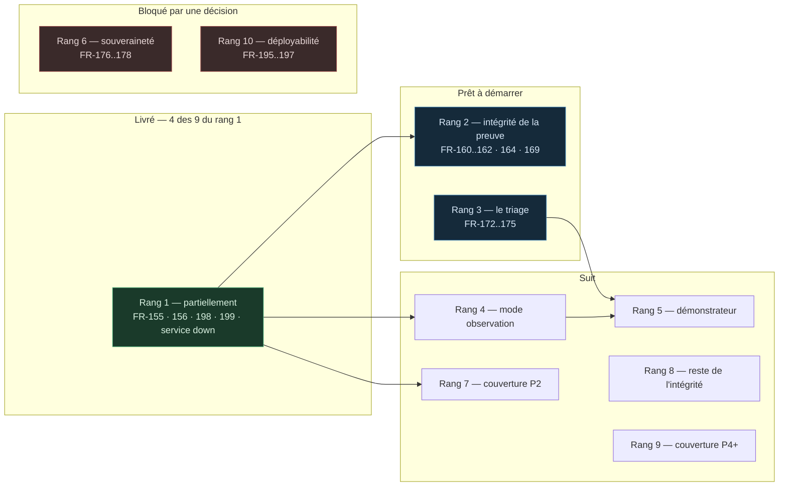

# Découpage du travail — ce qui se construit, dans quel ordre, et ce qui bloque quoi

> **Audience** : l'équipe qui construit, et quiconque doit arbitrer un retard.
> **Autorité** : la PRD §5 pour les rangs, `ARCHITECTURE-V2.5.md` pour les décisions,
> `THREAT-COVERAGE.md` pour les écarts. Ce document projette ces trois-là ; il ne les
> modifie pas.

---

## 1. La règle d'ordonnancement

Trois contraintes, dans cet ordre :

1. **Ce que le produit affirme sans le tenir.** Un contrôle déjà livré et déjà
   revendiqué qui ne tient pas sa garantie passe avant toute nouveauté. Ce n'est pas
   de la dette : c'est une affirmation fausse en production.
2. **Ce que le terrain exige.** P2 avant P3 — les profils d'usage réellement
   rencontrés, pas ceux qui font une meilleure démonstration.
3. **Ce qu'une revue de sécurité trouve en premier.** Sur un produit vendu sur la
   preuve, l'intégrité de la preuve est le premier endroit qu'on attaque.

---

## 2. L'état d'avancement

---

## 3. Rang 1 — cœur d'enforcement · **partiellement livré**

Le lot qui rendait vrai ce que le produit affirmait déjà.

| Item | Sujet | État |
|---|---|---|
| `FR-198` | `.env.example` promettait un fail-closed que le code n'implémentait pas : sans clé de modèle, une règle `classify: ambiguous` tenait son `approval` déclarée, `auto` incluse | ✅ **Livré** — `resolve_ambiguous`, partagée par les deux chemins |
| `FR-199` | Les contraintes d'une règle ambiguë n'étaient jamais évaluées : `evaluate` retournait avant le contrôle | ✅ **Livré** |
| `FR-155` | Vocabulaire des contraintes clos et versionné ; une clé inconnue fait échouer le document (`EXH-2`, `D-2`, `G-11`) | ✅ **Livré** — refus au parse **et** à l'évaluation |
| `FR-156` | Toute contrainte publiée dans un exemple ou une démo est effectivement appliquée, ou retirée | ✅ **Livré** — `dry_run` implémenté en plancher d'approbation ; `reversible` et `business_hours_only` retirés de `SPEC.md` |
| — | Service d'approbation injoignable : refus sur MCP, HTTP 500 sur `/v1/authorize` | ✅ **Livré** — `service_down_verdict` partagée |
| `FR-153` | Détection de contenu injecté en FR/ES/DE + normalisation unicode, encodages, homoglyphes (`D-1` : regex anglaise uniquement) | ⬜ À faire |
| `FR-154` | Taint lié au **jeton de passerelle**, pas au `session_id` déclaré par l'agent : un identifiant neuf ne remet pas la session à blanc (`INV-4`, `G-03`) | ⬜ À faire |
| `FR-157` | Prédicat déterministe borné sur la valeur des arguments — non Turing-complet, échouant fermé sur champ absent ou mal typé (`EXH-3`) | ⬜ À faire |
| `FR-158` | Classification déterministe des outils exécuteurs (`bash`, `execute_sql`, `kubectl`) sans passer par le juge (`EXH-4`, `G-06`) | ⬜ À faire |
| `FR-159` | Approbation par canal non rejouable : identité issue de la signature du fournisseur, désignant le *cliqueur*, SoD vérifiée contre lui (`INV-5`, `D-3`, `G-07`) | ⬜ À faire |

**Quatre des neuf sont livrés — et c'est la moitié du vocabulaire de contraintes qui
part avec.** `FR-155` et `FR-156` allaient ensemble : fermer le vocabulaire sans
implémenter `dry_run` aurait fait échouer la policy de démonstration, et implémenter
`dry_run` sans fermer le vocabulaire aurait laissé les autres clés décoratives.

**Ce qui reste est le taint et l'approbation rejouable**, plus les deux prédicats.
Le taint et l'approbation portent chacun un `Bloqué` revendiqué aujourd'hui : `M-02`
que `D-1` fragilise, `M-08` que `INV-5` traverse. Ce sont les deux dernières
affirmations du produit qui ne sont pas vraies.

---

## 4. Les rangs, et ce que chacun débloque

| Rang | Lot | Contenu | Dépend de | Débloque |
|---|---|---|---|---|
| **1** | Cœur d'enforcement | `FR-153`→`159`, `198`, `199` — *4 / 9 livrés* | — | Tout. Rien d'autre ne compte tant que les garanties revendiquées ne sont pas vraies |
| **2** | Intégrité de la preuve | `FR-160`, `161`, `162`, `164`, `169` | Rang 1 | La crédibilité devant une revue. `FR-162` a le plus fort rayon de souffle du lot |
| **3** | Le triage · **pilier 1** | `FR-172`→`175` — *`G-18` fermé* | — | Le démonstrateur. Sans lui, la démonstration retombe dans le catalogue. **La carte est désormais générée** (`coverage/`), donc `CM-7` est mesuré en continu au lieu d'être une intention |
| **4** | Mode observation | `FR-179`, `180` | Rang 1 | Le démonstrateur, **et** `G-25` : la bonne forme du correctif du proxy LLM est une fenêtre d'observation du plan de contrôle |
| **5** | Le démonstrateur | `FR-181`→`183` | Rangs 3 et 4 | La preuve publique |
| **6** | Souveraineté · **pilier 3** | `FR-176`→`178` | `QO-3` ✅ tranchée | `G-17`, `G-21` |
| **7** | Couverture P2 | `FR-184`, `185`, `186` | Rang 1 | Le terrain dit P2 avant P3 |
| **8** | Reste de l'intégrité | `FR-163`, `165`→`168`, `170`, `171` | Rang 2 | Contraignant, non bloquant pour la démonstration |
| **9** | Couverture P4 et au-delà | `FR-187`→`194` | Rang 7 | Suit la base installée Mistral |
| **10** | Déployabilité, positionnement | `FR-195`→`197` | `AR-3` | `FR-197` est de la rédaction : parallélisable dès maintenant |

**Ce qui tombe si nous sommes en retard :** les rangs 9 et 10 d'abord, puis 8. **Les
rangs 1 à 5 sont le démonstrateur** ; en retirer un revient à ne pas livrer la strate.

---

## 5. Les écarts nouveaux, et où ils atterrissent

Cinq écarts ont été ouverts après la rédaction de la PRD, en vérifiant le code
plutôt qu'en le supposant. Aucun ne crée de rang nouveau — chacun se rattache.

| Écart | Sujet | Rattaché à | Sévérité |
|---|---|---|---|
| `G-22` | La rédaction avant envoi au juge masque par *nom de clé*, pas par contenu : une PII dans la valeur d'une clé anodine atteint le modèle | Rang 7 (couverture P2, avec la DLP) | Haute |
| `G-23` | `business_hours_only` retiré de `SPEC.md` faute d'implémentation ; demande un fuseau par tenant | Rang 8 | Basse |
| `G-24` | `allowed_clients` n'est appliqué que par le gateway MCP : la même policy n'est pas également bornée sur `/v1/authorize` | Rang 1 (divergence d'ingress) | Haute |
| `G-25` | ~~Le mode d'enforcement lu dans un en-tête de requête~~ — **fermé.** Fenêtre d'observation de plan de contrôle, bornée, réservée à l'`admin` | Rang 4 — livré | ✅ |
| `G-26` | La branche streaming du proxy LLM contourne entièrement la garde d'appels d'outils, sans ligne d'audit | Rang 7 | Critique |

**`G-25` est la raison de remonter le rang 4.** La PRD le plaçait en quatre « seulement
parce qu'il ne bloque pas le tournage ». Il s'avère maintenant être le véhicule du
correctif d'un défaut critique — l'enforcement doit devenir un réglage de plan de
contrôle avec fenêtre d'observation bornée, ce qui *est* le rang 4.

---

## 6. Ce qui est parallélisable, et ce qui ne l'est pas

**Parallélisable dès maintenant, sans dépendance :**

- Rang 3 (le triage) — ne dépend d'aucun autre rang. C'est le pilier 1 et il peut
  démarrer en parallèle du rang 2.
- `FR-197` (positionnement) — de la rédaction, pas du code.
- Rang 6 (souveraineté) — `QO-3` est tranchée, plus rien ne le retient.

**Séquentiel, et il faut y résister :**

- Rangs 1 → 2 : l'intégrité de la preuve n'a pas de sens tant que ce qui est prouvé
  n'est pas vrai.
- Rangs 3, 4 → 5 : le démonstrateur est un assemblage. Le construire avant ses pièces
  produit une démonstration qu'il faut refaire.

**Une contrainte transverse, qui n'est pas un rang** : `AD-37`. Toute logique désormais
partagée par les deux adaptateurs va dans une étape de `core/`, jamais dans une seconde
copie. Deux étapes existent (`resolve_ambiguous`, `service_down_verdict`) ;
l'extraction est finie quand `core/pipeline.py` porte l'ordre déclaré d'`AD-33`. Ce
n'est pas un lot à planifier : c'est une règle qui s'applique à chaque lot.

---

## 7. Les décisions encore ouvertes, et ce qu'elles bloquent

| Ouverte | Bloque | Nature |
|---|---|---|
| `QO-7` — le diagnostic de profil est-il un livrable de mission ou une fonction de la console ? | La forme du rang 3, pas son démarrage | **Commerciale.** Les deux réponses produisent des architectures différentes ; trancher techniquement serait deviner |
| `QO-9` — quel domaine pour le tenant synthétique ? | Rang 5 | Narrative. `AD-31` fixe déjà la forme (semence committée, déterministe, sans PII) |
| `AR-1` — NIS2 / DORA / ANSSI | Rien du rang 1-5 | Différée en attente d'un évaluateur en exercice. La table de correspondance déclarative rend l'ajout peu coûteux |
| `AR-3` — périmètre de déploiement | Rang 10 | Arbitrage de release |

**Tranchées depuis :** `QO-3` (critère de souveraineté = dépendance opérationnelle),
`QO-8` / `AR-2` (le proxy LLM est séparable, `M-10` garde son `Bloqué`), amplitude
d'extraction (`AD-37`).

---

## 8. La mesure

| ID | Mesure | Cible |
|---|---|---|
| `SM-12` | Menaces applicables couvertes en `Bloqué`, sur le profil P2/P3 de référence | ≥ 6 sur 9 |
| `SM-13` | Scénarios d'attaque assertés en CI | 100 % des vidéos publiées |
| `SM-14` | Délai entre une régression de défense et sa détection | Un cycle CI |
| `SM-15` | Appels sortants hors UE requis sur le chemin de décision | **0** |
| `CM-6` | *Contre-mesure* — clients restant indéfiniment en mode observation | À surveiller |
| `CM-7` | *Contre-mesure* — écart entre lignes revendiquées `Bloqué` et lignes réellement assertées par un scénario | **0 attendu** |

`CM-7` est la mesure qui compte le plus, et c'est une **contre**-mesure : elle ne
récompense pas ce qu'on ajoute, elle punit ce qu'on revendique sans le prouver.
