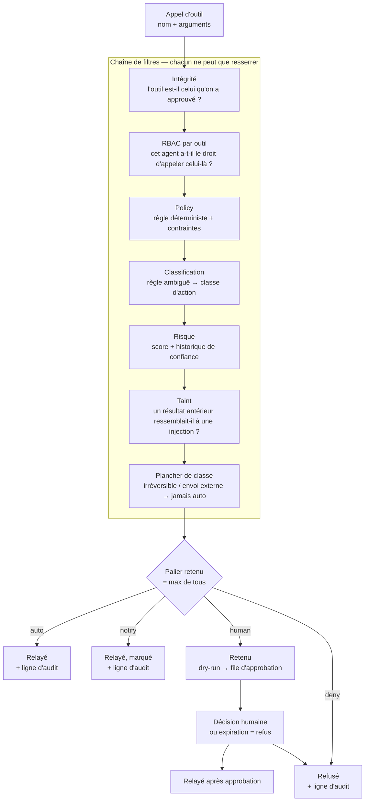

# xSOM AI Guard — document de design

> **Audience** : architecte, RSSI ou évaluateur technique qui veut comprendre comment
> le produit fonctionne avant de décider s'il y croit. Et l'équipe qui le construit.
>
> **Ce document explique.** Il ne décide rien : les décisions vivent dans
> `ARCHITECTURE-V2.5.md` (les `AD-n`), les exigences dans la PRD, la couverture dans
> `THREAT-COVERAGE.md`. Chaque affirmation ci-dessous renvoie à l'une d'elles ou à un
> fichier du dépôt.

---

## 1. Ce que le produit contrôle

Un agent IA ne cause pas de dommage en écrivant du texte. Il en cause en **agissant** :
en supprimant un enregistrement, en envoyant un e-mail, en déclenchant un virement, en
appelant une API métier. xSOM AI Guard se place sur ce point-là — la frontière entre
« l'agent a décidé » et « l'action a lieu » — et n'en bouge pas.

Ce n'est **pas** un pare-feu de prompts. Un garde-prompt inspecte ce qu'on dit au
modèle ; il ne sait pas ce que le modèle va faire, et il se contourne par
reformulation. Ici on n'inspecte pas l'intention, on interpose l'exécution.

La conséquence pratique : **une injection de prompt réussie ne suffit pas.** L'agent
peut être entièrement convaincu de devoir supprimer la base ; l'appel qui le ferait
passe quand même par la policy, la classe d'action, le plancher d'irréversibilité et,
le cas échéant, un humain.

---

## 2. Le chemin d'un appel

**Trois propriétés portent tout le reste.**

**a. Chaque filtre renvoie un *minimum*, jamais un verdict.** La chaîne replie par
`max` sur l'ordre des paliers (`auto` < `notify` < `human_in_the_loop` < `human_dual`
< `deny`). Un filtre ne peut donc que resserrer. « Aucune garde n'en affaiblit une
autre » devient une propriété de la forme, pas une convention qu'il faut se rappeler
(`AD-21`).

**b. Un repli par `max` ne peut pas injecter une valeur qu'aucun filtre n'a produite.**
C'est pour cela que le **plancher de classe** est une étape nommée, ordonnée en
dernier, et non une propriété émergente. Une règle de policy peut parfaitement
déclarer `class: irreversible, approval: auto` — le parseur l'accepte. Le plancher
existe pour rendre ce document sûr, pas pour l'interdire (`AD-21.2`).

**c. Le LLM n'est jamais dans le verdict.** Le juge produit une *classe d'action* ; il
ne renvoie jamais de palier et ne décide jamais. Et son absence n'est pas son silence :
sans clé de modèle, il contribue sa classe d'échec — `irreversible` — donc une règle
ambiguë part en approbation humaine au lieu d'être auto-autorisée (`AD-34`,
`core/judge.py`). Une instance sans clé est **plus stricte**, pas moins.

---

## 3. La direction d'échec, partout

C'est la propriété la plus simple à énoncer et la plus facile à perdre :

> Chaque filtre déclare son verdict d'échec, et celui-ci est **toujours au moins aussi
> serré** que son verdict de succès.

Ce que cela donne concrètement :

| Ce qui casse | Ce qui se passe |
|---|---|
| Outil inconnu de la policy | `deny` (défaut `unknown_tool`) |
| Clé de contrainte inconnue ou malformée | Document refusé au parse ; refus à l'évaluation si le parseur a été contourné |
| Juge indisponible ou hors budget | Classe `irreversible` → approbation humaine |
| Service d'approbation injoignable, action irréversible ou classe inconnue | `deny` — sur les deux chemins. Sur une classe plus légère, le réglage `on_approval_service_down` du tenant s'applique |
| Session dont le taint est illisible | Traitée comme teintée, jamais comme propre — **`AD-10`, pas encore construit** : le taint est aujourd'hui en mémoire, donc aucune lecture ne peut échouer |
| Notification d'approbation en échec | L'approbation **reste en attente** — donc l'action reste bloquée |

Toutes ces lignes sauf la dernière ont un test aujourd'hui ; la dernière est une décision d'architecture dont le code n'existe pas encore, et elle est marquée comme telle. C'est la distinction que ce document s'oblige à tenir partout.

---

## 4. Les trois chemins d'ingestion, et pourquoi la distinction compte

Un agent peut arriver par trois portes, et **elles ne portent pas les mêmes garanties**.
C'est la chose la plus importante à comprendre pour lire une revendication de
couverture honnêtement (`AD-28`).

| Chemin | Nature | Ce qu'il couvre |
|---|---|---|
| **Gateway MCP** (`gateway/`) | **Contraignant** — xSOM exécute l'appel, ou ne l'exécute pas | La chaîne complète : intégrité, RBAC par outil, policy, classe, risque, taint, plancher, HITL |
| **`/v1/authorize`** (`api/`, `core/decision.py`) | **Coopératif** — l'agent demande avant d'agir et honore le verdict ; xSOM n'exécute rien | Policy, classe, risque, plancher, HITL. **Pas** l'intégrité, **pas** le RBAC par outil, **pas** le taint |
| **Proxy LLM** (`api/llm_proxy.py`) | Mixte | DLP d'egress **contraignante et inconditionnelle**. La garde d'appels d'outils y est en revanche optionnelle au choix de l'appelant (`G-25`) et absente en streaming (`G-26`) |

**Ce que cela impose au discours commercial.** Une ligne `Bloqué` vraie sur MCP se lit
comme vraie partout si on ne dit rien. Donc on le dit : la carte de couverture affiche
le **mode** *et* le **chemin d'ingestion**, et le proxy LLM ne compte dans aucune
revendication de contrôle d'appels d'outils tant que `G-25` et `G-26` tiennent.

`AD-35` fixe la cible — tout chemin exécute la chaîne complète, et une entrée
manquante est un manque de capacité *déclaré*, pas un filtre sauté en silence. La
convergence des trois chemins est en cours (`AD-37`), pas acquise.

---

## 5. La preuve

Un contrôle qu'on ne peut pas prouver après coup ne vaut rien devant un auditeur.

**La chaîne d'audit est append-only et hash-chaînée.** Chaque entrée porte le hash de
la précédente ; modifier ou retirer une ligne casse toutes les suivantes.
`verify_chain` le vérifie localement, sans dépendance externe. Aucune policy `UPDATE`
ou `DELETE` n'existe sur la table (`CLAUDE.md` §4.2).

**Ce qui est écrit, et ce qui ne l'est jamais.** L'entrée porte le nom de l'outil, la
classe d'action, la décision, la règle appliquée, un **hash** des arguments, et
l'horodatage. Jamais le contenu des arguments, jamais de PII (`CLAUDE.md` §4.10).

**Ce que `judge_used` veut dire, précisément.** *Un appel modèle a eu lieu* — pas *la
règle était ambiguë* (`AD-21.4`). Un défaut fail-closed n'est pas porté au crédit d'un
juge inexistant. Sur un produit vendu sur la preuve, un journal immuable qui dit une
chose fausse est pire qu'un journal absent.

**Isolation.** Multi-tenant par RLS Postgres, pas seulement applicative.

---

## 6. L'humain dans la boucle, et pourquoi il est au gateway

Le HITL est garanti **au niveau du gateway**, jamais délégué au LLM. Une action
irréversible non approuvée n'est pas exécutée — pas « déconseillée au modèle ».

Le cycle : l'appel est retenu → un **dry-run** décrit l'effet sans le déclencher
(« envoi d'un e-mail à x@client.fr, objet … ») → l'approbation entre en file →
un ou deux humains décident (`human_dual` = deux approbateurs distincts) →
l'expiration vaut refus.

**`dry_run` comme contrainte de policy relève le plancher d'approbation à
`human_in_the_loop`.** Un dry-run que personne ne voit n'en est pas un ; déclarer
l'exigence sans forcer un humain n'aurait rien voulu dire.

---

## 7. La doctrine de couverture graduée

Cinq modes, et un seul autorise le verbe « bloquer » :

| Mode | Ce qu'on peut en dire |
|---|---|
| **Bloqué** | L'action est empêchée par notre code, sur un chemin nommé, et un scénario l'asserte |
| **Détecté** | On le voit et on le trace ; on ne l'empêche pas |
| **Orchestré** | Un contrôle tiers l'empêche ; nous le pilotons et chaînons son verdict |
| **Attesté** | Nous produisons la preuve qu'un contrôle humain ou organisationnel a eu lieu |
| **Hors périmètre** | Nous n'y répondons pas, et nous le disons |

**Deux axes, jamais un seul.** *Applicabilité* (est-ce que cela concerne ce client,
vu son profil d'usage) × *couverture* (que savons-nous faire). Les attaques qui visent
un fournisseur de modèle ne sont pas celles qui visent une banque qui consomme une API.
Le compte utile n'est pas « 16 menaces », c'est « **N vous concernent, M sont
bloquées** ».

**La carte est générée depuis les scénarios qui passent, jamais rédigée** (`AD-30`).
Une ligne `Bloqué` sans scénario qui l'asserte est un écart mesuré, pas une nuance de
rédaction — c'est `CM-7`, dont la cible est zéro.

---

## 8. Ce que le design ne fait pas

- **Pas de garde-prompt, pas de PII stripping en entrée.** Point d'extension, pas
  fonctionnalité (V1.1).
- **Pas de médiation RAG, pas de détection d'anomalie par ML.** `§7.2` exclut tout
  modèle ML près d'un verdict.
- **Pas de second moteur de stockage, pas d'ORM.** Un Postgres contrôlé par
  l'exploitant suffit au chemin de décision (`AD-32`).
- **Pas de découverte du Shadow AI.** C'est du territoire CASB, et faute de substitut
  souverain la ligne est déclassée plutôt que revendiquée (`FR-178`).

---

## 9. Où lire la suite

| Question | Document |
|---|---|
| Quelles décisions d'architecture, et ce qu'elles empêchent | `ARCHITECTURE-V2.5.md` |
| Quelle menace est couverte, comment, sur quel chemin | `THREAT-COVERAGE.md` |
| Ce qui ne sort jamais du périmètre | `ARCHI-SOUVERAINE.md` |
| Dans quel ordre c'est construit, et ce qui bloque quoi | `DECOUPAGE.md` |
| Le contrat de données et d'API | `docs/SPEC.md` |
