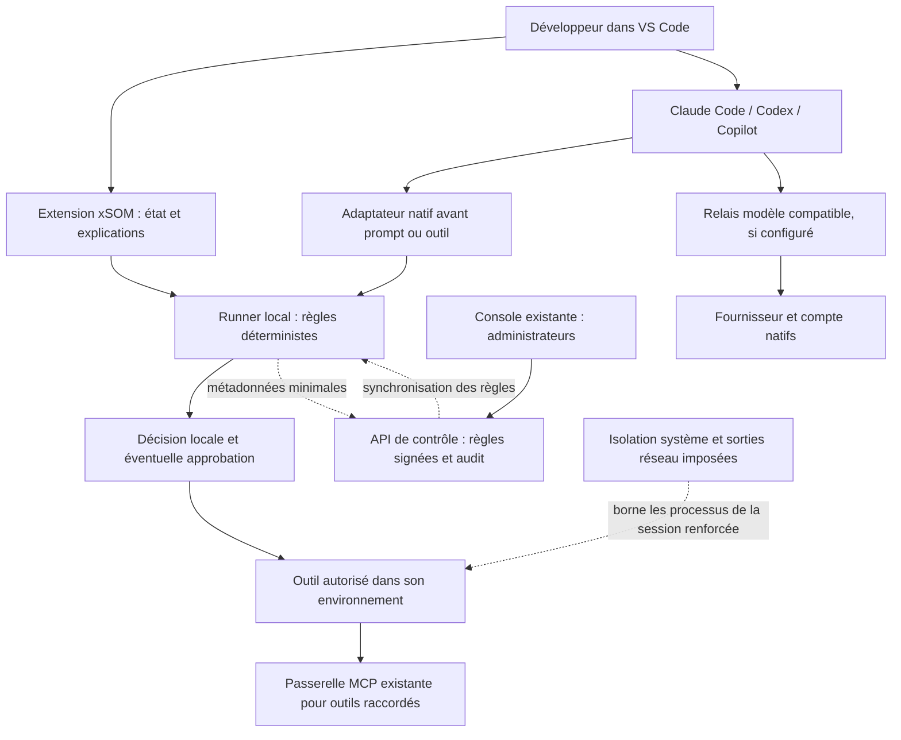

# xSOM Developer Guard — plan produit et implémentation

Date : 22 septembre 2026. Statut : plan approuvé et exécuté localement ; l’état détaillé et les limites de qualification sont suivis dans [`IMPLEMENTATION-STATUS.md`](IMPLEMENTATION-STATUS.md).

Objectif : permettre à une entreprise d'autoriser Claude Code et Codex dans VS Code, avec des règles vérifiables sur les données accessibles, les actions exécutables et les preuves disponibles. Conserver le parcours et l'abonnement natifs lorsque le fournisseur le permet.

Exécution prévue : Terra medium pour les lots techniques T00–T14, puis Astra pour les lots de présentation A01–A04. Les noms et tarifs ci-dessous sont des propositions, pas des offres déjà commercialisées. Hypothèse de lancement : PME/ESN de 10 à 100 développeurs, puis grands comptes sur postes administrés.

## 1. Audit de l'existant en 15 points

1. Le workspace `secret-guard/` et le manifeste VS Code sont en version **0.6.0** ; le README porte encore un titre V0.2.
2. Le core TypeScript est déterministe, local, sans réseau : le conserver comme bibliothèque indépendante.
3. Les modes Bloquer, Expurger et Avertir existent ; Avertir laisse réellement passer le contenu et doit donc être gouverné en entreprise.
4. `host-config.ts` configure trois hôtes : Copilot, Claude Code, Codex. Cela ne prouve pas leur invocation effective sur chaque version.
5. Le hook de prompt inspecte aussi les fichiers explicitement mentionnés ; Claude possède en plus un hook `PreToolUse` limité à `Read`.
6. Ce matcher ne protège pas à lui seul les lectures par terminal, recherche, outils MCP ou contexte ajouté par l'hôte.
7. `@secretguard` contrôle son propre flux et ses références textuelles ; il ne contrôle pas les conversations des autres extensions.
8. Le raccordement Claude utilise un relais local puis le proxy Anthropic existant ; son nettoyage ne constitue pas une autorisation des actions des outils.
9. Le traitement de pièces jointes du relais est documenté séparément ; sa couverture ne s'étend pas aux pièces jointes natives Codex/Copilot.
10. `api/extension_devices.py`, `api/extension_ingest.py` et `core/extension_devices.py` apportent déjà inventaire et événements par tenant.
11. La console `/extensions` et la migration `0034_extension_devices.sql` existent : les étendre, sans recréer une console de parc.
12. Le backend possède policy, approbations, RBAC/RLS, empreintes d'outils et audit : réutiliser ces mécanismes.
13. Les droits commerciaux existent dans `core/entitlements.py` ; les protections de base ne doivent pas dépendre d'un paiement réussi.
14. La couverture publiée est déjà dérivée de scénarios (`coverage/rows.yaml` → carte → frontend). Le glossaire n'a toutefois qu'une couverture globale par menace.
15. `/extension` cite encore Windsurf dans ses métadonnées alors que l'installateur actuel ne le configure pas ; les promesses doivent devenir spécifiques au produit et au chemin testé.

Sources locales principales : `secret-guard/README.md`, `secret-guard/packages/{core,cli,vscode}/src/`, `docs/secret-guard/GATEWAY_AUDIT.md`, `docs/secret-guard/attachments.md`, `frontend/lib/threat-glossary.ts`, `frontend/e2e/glossary.spec.ts`, `scripts/gen_coverage.py`.

Le document fourni ensuite, [`../menaces-backend-brainstorm.md`](../menaces-backend-brainstorm.md), recense **77 menaces** et des outils candidats. Il est intégré exhaustivement dans [`DEVELOPER-THREAT-MAPPING.md`](DEVELOPER-THREAT-MAPPING.md). Ce catalogue est une matière de conception, pas une preuve de contrôles backend livrés. Son examen ajoute au cadrage la mémoire persistante de l'agent, le rendu des sorties dans l'extension, le cloisonnement des délégations et une option ultérieure pour les artefacts de modèles locaux.

Cette lecture établit la présence des briques, pas leur déploiement actuel ni une nouvelle validation E2E. L'audit mécanique du skill sécurité a également été exécuté sans outils externes : 30 signalements bruts, dont exemples de secrets, fixtures et interpolations de constantes SQL. Les candidats de production examinés ne suffisent pas à conclure à une faille : paramètres SQL séparés, clés d'exemple, docs FastAPI conditionnelles. Ne pas transformer ce scan heuristique en bilan de vulnérabilités confirmé.

## 2. Arbitrages produit

### Une extension, une offre développeur, des modules activables

**Nom de gamme proposé : xSOM Developer Guard.** Conserver l'identifiant Marketplace `xsom.xsom-secret-guard-vscode`, les réglages et commandes existants pendant la migration. Le nom visible peut évoluer après validation commerciale. Éviter plusieurs extensions concurrentes qui installeraient les mêmes hooks ou afficheraient des états contradictoires.

| Composant | Rôle | Distribution |
|---|---|---|
| Secret Guard | Empêcher l'envoi des secrets détectables sur les chemins inspectés | Module local gratuit conservé |
| Contrôle des agents | Autoriser, refuser ou soumettre à validation les outils, commandes et accès | Module de la même extension + CLI |
| Administration d'équipe | Déployer les règles, gérer les postes et exceptions, expliquer les incidents | Console xSOM existante |
| Environnement renforcé | Imposer les limites de fichiers, réseau et processus dans une session gérée | Installation administrateur / environnement isolé, distinct du VSIX |
| Passerelles xSOM | Contrôler les flux modèle ou MCP effectivement raccordés | Services existants, option de déploiement |

La valeur commerciale est la cohérence multi-assistants, la facilité de déploiement et la preuve des contrôles. Les politiques natives des éditeurs sont des mécanismes à piloter ; leur simple présence n'est pas un différenciateur suffisant.

### Trois profils techniques, indépendants des prix

| Profil | Utilisation | Engagement raisonnable |
|---|---|---|
| Local | Installation individuelle, hooks utilisateur | Protection sur les chemins testés ; désactivable par l'utilisateur |
| Équipe | Enrôlement, règles signées, audit, configuration administrée lorsque disponible | Politique commune et détection des écarts ; résistance au retrait dépendant de l'administration du poste |
| Renforcé | Session isolée, identité dédiée, fichiers/secrets restreints, sorties réseau imposées | Blocage des opérations couvertes dans cet environnement, y compris certains contournements des hooks |

Une extension ne constitue pas un EDR ou un contrôle système universel. Un développeur administrateur peut retirer une protection installée avec ses propres droits. Une session renforcée ne protège pas automatiquement son navigateur personnel ou un autre binaire lancé hors de la session.

### Périmètre de première livraison

- Claude Code et Codex dans VS Code local ; priorité de validation Windows, puis macOS. Exiger une preuve pour chacun avant de le déclarer disponible.
- Copilot : conserver la protection existante et ajouter les contrôles d'actions après validation de ses contrats spécifiques.
- Linux : runner CLI et première session renforcée de référence. WSL, Remote SSH et Dev Containers nécessitent chacun une ligne de compatibilité et une installation côté exécution.
- VS Code Web/Codespaces, assistants cloud, Windsurf et Cursor : non supportés par cette nouvelle promesse tant qu'un lot dédié n'a pas produit ses preuves.
- Aucun LLM sur le chemin obligatoire d'autorisation. Détection sémantique éventuelle en analyse secondaire, sans pouvoir accorder une permission.

## 3. Ce que les fournisseurs permettent réellement

Documentation consultée le 22 septembre 2026 ; revalidation et versions exactes obligatoires en T00.

| Surface | Possibilité documentée | Conséquence pour xSOM |
|---|---|---|
| Claude Code | Hooks avant outils, paramètres administrés, permissions natives | Étendre au-delà de `Read`, sans assimiler échec du hook et refus de l'action [S1, S2] |
| Codex | Hooks avant outils locaux, configuration administrée, restrictions de permissions | Adaptateur propre ; ne pas copier le JSON Claude. Certains outils hébergés et entrées ultérieures de terminal échappent au hook [S3, S4] |
| Copilot / VS Code | Hooks documentés en Preview et politiques d'entreprise | Compatibilité par version ; ne pas confondre les contrats CLI et VS Code [S5, S6] |
| Claude via relais | La seule modification de `ANTHROPIC_BASE_URL` peut conserver la connexion par abonnement ; les en-têtes OAuth requis doivent être relayés | Conserver le mécanisme existant et prouver compte/facturation en session réelle, sans installer une clé API à sa place [S7] |
| Gestion VS Code | Politiques telles qu'`AllowedExtensions` | Fournir des profils administrateur ; une extension utilisateur ne peut pas s'attribuer ces pouvoirs [S6] |

**Point bloquant pour une promesse forte :** Claude documente qu'un timeout de hook de commande `PreToolUse` ne bloque pas nécessairement l'appel ; il poursuit le circuit normal des permissions. Un runner qui répond « deny » à ses erreurs internes ne suffit pas si le runner est absent ou tué. Distinguer les garanties du moteur, de l'adaptateur et du système d'exécution. [S1]

**Pas de contrôle universel des résultats par un hook après outil :** l'action a déjà pu avoir lieu et un résultat peut déjà être traité. Le contrôle du contenu avant envoi exige un point d'interception prouvé ou un relais de sortie compatible. [S1, S3]

## 4. Architecture cible

Les flèches décrivent les chemins supervisés. Les chemins absents de ce schéma restent explicitement non couverts. Ne pas ajouter un proxy TLS universel ou capturer les sessions OAuth pour fabriquer une intégration non documentée.

### 4.1 Runner et adaptateurs

- Garder `packages/core` pour les secrets. Ajouter `packages/policy` pour l'évaluation locale, `packages/adapters` pour les contrats d'hôtes, `packages/runner` pour fichiers, IPC et cycle de vie. Ces packages sont de nouvelles responsabilités précises, pas une réécriture du scanner.
- Commencer par un processus ponctuel compatible avec les hooks. N'ajouter un daemon que si les mesures de démarrage le justifient. Le service administré du profil renforcé est un lot distinct.
- Un contrat interne normalise `assistant`, version, événement, session, outil, catégorie d'action, ressources demandées et capacité réelle d'interception. Les arguments sensibles ne sont manipulés qu'en mémoire.
- Décision fermée : `allow`, `deny`, `require_approval`. `unknown` décrit une capacité ou une analyse non établie ; il ne se convertit jamais automatiquement en `allow` pour une action risquée.
- L'adaptateur transforme cette décision dans le protocole exact de l'hôte. JSON inconnu, champ non pris en charge ou version non testée produit un état « non vérifié » et une restriction sur les chemins que xSOM maîtrise.
- Les opérations au long cours, PTY, sous-agents, changements de répertoire et reprises de session doivent conserver l'identité et la politique ; une nouvelle entrée dans un terminal déjà approuvé n'est pas une nouvelle commande approuvée.
- Les fichiers de mémoire/instructions autochargés sont des ressources sensibles : observer et contrôler leurs écritures lorsque possible, attribuer leur provenance, proposer une restauration sans perdre le travail humain. Un changement non autorisé ne doit pas devenir une permission au prochain démarrage. Un serveur RAG distant reste une responsabilité distincte.

### 4.2 Politique et autorité

Une autorité de configuration serveur, avec un sous-ensemble local déterministe versionné. Réutiliser les classes d'action et mécanismes de `core/policy.py` ; ne pas porter tout le moteur Python en TypeScript. Définir les règles locales communes par schéma et jeux de conformité exécutés des deux côtés.

Enveloppe signée proposée : `schemaVersion`, `tenantId`, `policyId`, `version`, `issuedAt`, `expiresAt`, `minRunnerVersion`, `audience`, règles, `keyId`, signature Ed25519. Canonicalisation définie et testée ; clé privée hors client, rotation des clés et révocation documentées.

Ordre : plancher sécurité → organisation → équipe/projet → préférence utilisateur. Les couches inférieures peuvent restreindre davantage ; tout assouplissement passe par une exception explicite et autorisée. Une règle du dépôt, `AGENTS.md`, `CLAUDE.md` ou `.mcp.json` n'est jamais autorité de sécurité.

Politiques initiales : secrets interdits, catégories de fichiers protégées, racines autorisées, outils/MCP autorisés, destinations, opérations sensibles, contrôles de qualité requis. Les scripts et regex fournis par un projet non fiable ne sont jamais exécutés comme règles.

Hors ligne : dernière politique valide utilisable jusqu'à son expiration ; première activation sans politique valide refuse le mode géré. À expiration, maintenir les scans locaux et refuser les actions gérées nécessitant autorisation fraîche. Révocation hors ligne seulement à l'expiration du bail : afficher ce délai résiduel, ne pas promettre une révocation instantanée. Proposer un bail de 24 h par défaut, plus court pour les projets sensibles, à tester et contractualiser.

### 4.3 Fichiers, terminal et sorties réseau

- Protéger `.env`, clés privées, fichiers de credentials et répertoires sensibles par règles de chemins et classification ; scanner seulement les données accessibles dans le budget prévu.
- Résoudre chemins relatifs, symlinks, jonctions Windows, casse, UNC et traversées. La vérification d'un chemin avant une lecture par un autre processus laisse une course possible : utiliser l'isolation système pour la garantie forte.
- Une liste de commandes interdites améliore l'explication mais ne suffit pas à contrôler shell, Python, Node, PowerShell ou scripts npm. Le parser doit reconnaître les formes supportées ; forme ambiguë → validation/refus selon profil, jamais « sûre » par défaut.
- Les commandes arbitraires de build restent confinées dans le profil renforcé ; filtrer `curl` ne bloque pas les bibliothèques réseau d'un interpréteur.
- Séparer l'accès du processus assistant au fournisseur de l'accès des sous-processus et des outils réseau. Un domaine fournisseur autorisé ne garantit pas que le corps envoyé soit exempt de données sensibles.
- Session renforcée : identité sans privilèges, pas de Docker socket, pas de montage de tout le home, pas de credentials de production, racines minimales, réseau sortant imposé. Réutiliser les primitives éprouvées du système/hôte ; ne pas écrire un sandbox maison.
- Première référence reproductible : environnement Linux isolé avec raccordement VS Code. Windows local sans politique système vérifiée reste profil Équipe. Ne pas annoncer une couverture Windows renforcée à partir d'un test Linux.

### 4.4 Approbations et audit

Réutiliser les APIs et la chaîne d'approbation existantes. Une approbation porte sur l'action exacte, le poste, la session, la politique, la destination et les ressources ; durée courte et consommation unique. Changement d'arguments, de fichier cible ou de politique → nouvelle décision. Le serveur doit vérifier le rôle ; l'agent ne peut pas s'auto-approuver par un appel d'outil.

Si le hook ne peut pas attendre, refuser avec un identifiant puis autoriser une nouvelle tentative après approbation valide. Ne jamais autoriser l'appel en cours pour contourner un timeout. La garantie reste limitée aux chemins où ce refus est effectivement appliqué.

La confirmation affichée ne contient ni secret ni corps complet de commande. Conserver le détail sensible localement et temporairement ; utiliser un engagement cryptographique non réversible par simple dictionnaire si nécessaire, avec clé et durée définies. Éviter les empreintes de secrets ou de prompts dans l'audit.

Événement proposé : identifiant, temps local/serveur, poste, hôte/version, type de contrôle, règle/politique/version, verdict, durée, mode de preuve et perte d'événements. Pas de prompt, contenu source, variable d'environnement, arguments bruts, credential fournisseur ou chemin personnel. Alias de projet plutôt qu'URL Git privée.

Provenances distinctes : déclaration client, test du runner, invocation observée de l'hôte, décision passerelle, effet vérifié en environnement de test. Un heartbeat n'est pas une attestation matérielle. La chaîne d'audit détecte certaines altérations ; elle ne garantit pas que le client ait tout déclaré.

### 4.5 Backend et identités

Conserver Supabase Auth, RLS et le backend existants ; ne pas ajouter un second fournisseur d'identité. Rôles cible : développeur, responsable de politique, approbateur, auditeur, administrateur ; mapper ceux-ci aux rôles existants ou migrer explicitement.

Enrôlement par code à usage unique depuis une session console authentifiée, lié au tenant par le serveur. Credential poste à permissions minimales, stocké dans SecretStorage/stockage OS, rotation et révocation. Séparer le droit d'ingérer des observations du droit de publier une politique ou d'approuver. Toute route nouvelle doit être limitée en débit et testée entre deux tenants réels.

Transport HTTPS et aucune clé Supabase privilégiée côté extension/frontend. La console de gestion ne nécessite pas de recevoir le code. Le relais modèle, lorsqu'il est utilisé, reçoit par définition le contenu en transit : exposer clairement cette différence et l'option de déploiement chez le client.

## 5. Matrice des menaces visées

Cette matrice est une **cible de conception**, pas un état de couverture livré. Les lots et tests décideront de la publication. Priorités : P0 avant pilote payant ; P1 avant offre renforcée ; P2 extension ultérieure.

Modes repris de la doctrine du dépôt : B = bloqué sur un chemin prouvé ; D = détecté ; O = contrôle tiers orchestré ; A = posture attestée ; X = hors périmètre. Une menace peut avoir plusieurs facettes ; ne jamais cocher toute la menace parce qu'une facette est bloquée.

| Menace / exemple | Contrôle cible | Limite et mode revendicable après preuve | Priorité |
|---|---|---|---|
| Secret dans un prompt ou fichier joint textuel | Scanner + refus/expurgation sur chemin compatible | B pour les formats/règles inspectés ; pas tous les secrets possibles | P0 |
| Lecture de `.env`, clés SSH ou credentials cloud | Refus de ressource + permissions de fichiers | B sur accès intercepté ; profil renforcé pour shell et courses | P0 |
| Secret dans sortie terminal, Grep ou MCP | Contrôle de résultat pré-envoi ou relais | B seulement si aucun octet interdit n'atteint le fournisseur ; sinon D/X | P0 |
| Exfiltration de code confidentiel | Projets/racines et destinations autorisés, classification | B pour ressources explicitement interdites ; détection sémantique exhaustive exclue | P0 |
| Données personnelles / données métier sensibles | Règles déterministes optionnelles et politique par catégorie | Partiel ; pas de garantie RGPD par regex | P1 |
| Images, PDF, fichiers encodés ou volumineux | Réutilisation du lecteur du relais, limites et refus des inconnus | B sur ce relais et formats testés ; OCR imparfait, autres chemins X | P1 |
| Prompt injection dans README, issue, page ou résultat d'outil | Réduire privilèges, destinations et actions indépendamment du texte | B pour l'action interdite ; la détection universelle de l'injection reste X | P0 |
| Instructions malveillantes dans skills/hooks/config du dépôt | Confiance explicite, intégrité et installation administrée | B/O pour chargements réellement contrôlés ; D pour modifications observées | P0 |
| Suppression, écrasement ou chiffrement du workspace | Règles d'écriture, commandes confinées, sauvegarde | B sur ressources protégées ; pas d'antiransomware général | P0 |
| Écriture hors workspace, symlink ou jonction | Canonicalisation et isolation système | B uniquement sous préconditions vérifiées ; hooks seuls partiels | P0 |
| Commande composée, substitution ou code encodé | Analyse bornée + interdiction des formes inconnues + sandbox | B pour opérations confinées ; pas de preuve par blacklist | P0 |
| Privilèges excessifs / élévation | Identité dédiée, pas de sudo, permissions gérées | O/B dans l'environnement renforcé | P1 |
| Accès production / SQL destructeur / infrastructure | Pas de credentials prod, passerelle outillée et approbation liée à l'action | B sur outil raccordé ; accès direct non contrôlé X | P0 |
| Push forcé, publication package ou déploiement | Permissions et approbation, protections côté serveur | B/O avec règle distante ; hook Git local contournable | P0 |
| Exfiltration HTTP, DNS, socket ou redirection | Sorties réseau imposées et MCP autorisés | B/O sur environnement renforcé, canaux couverts documentés | P1 |
| SSRF vers localhost, réseau privé ou metadata cloud | Proxy réseau et validation destination/redirection | B sur flux routé et protocole testé | P1 |
| MCP inconnu ou changement de description d'outil | Registre, empreinte, réapprobation, passerelle existante | B sur MCP raccordé ; un MCP ajouté hors chemin reste X | P0 |
| Extension VS Code ou plugin compromis | Liste d'extensions administrée, version/provenance, alertes | O/A ; aucune garantie contre une extension approuvée compromise | P1 |
| Dépendance malveillante, typosquatting, scripts d'installation | Lockfiles, registres, revue, audit SCA, build isolé | O/D ; registre autorisé ≠ paquet fiable | P1 |
| Code généré vulnérable | SAST/SCA et contrôles CI obligatoires | O/D ; bloquer une fusion en CI ne garantit pas l'absence de failles | P1 |
| Vol de session fournisseur ou token xSOM | Stockage OS, minimisation, restriction fichiers/processus | Prévention ciblée ; un poste compromis reste hors garantie | P0 |
| Usurpation d'approbation et rejeu | RBAC, expiration, usage unique, liaison à l'action | B dans le circuit d'approbation maîtrisé | P0 |
| Retrait du hook ou mode Avertir permanent | Politiques administrées, dérive visible, bail de session | D en local ; O/B dans session imposée, pas contre admin machine hostile | P0 |
| Sous-agent ou processus enfant moins contraint | Héritage politique/isolation, identité parent-enfant | B pour chemins prouvés ; sous-agent cloud externe X | P0 |
| Saturation du scanner / archive géante / boucle | Budgets de taille/temps, queues bornées, rate limits | B pour requêtes refusées, limites CPU/processus via isolation | P0 |
| Dépenses incontrôlées / bascule API involontaire | Diagnostic auth, mode de facturation connu, alertes/quota fournisseur | D/O ; aucune facture exhaustive déduite des seuls tokens vus localement | P0 |
| Audit falsifié, manquant ou rejoué | Chaînage, séquences, idempotence, source serveur | D/B pour ingestion invalide ; absence de collecte explicitée | P0 |
| Fuite inter-tenants ou compte admin compromis | RLS, RBAC, MFA selon offre d'identité, sessions/révocation | B pour autorisations testées ; contrôle organisationnel complémentaire | P0 |
| Mise à jour xSOM compromise | Provenance, artefacts vérifiés, canary, rollback | O/A et tests de refus d'artefact altéré | P0 |
| Phishing général, deepfake, vol de modèle, poisoning de préentraînement, zero-day OS | EDR, messagerie, IAM ou fournisseur de modèle | X ; pointer les contrôles complémentaires dans le glossaire | P2 / hors produit |

Étendre le glossaire existant seulement lorsqu'une menace manque ; conserver les identifiants existants. Rattacher les facettes aux références OWASP déjà présentes sans inventer de nouveaux identifiants de standard. Une correspondance à OWASP ne constitue pas une certification.

## 6. Parcours produit

**Développeur :** installer → voir les assistants détectés → tester un cas synthétique dans chaque assistant → connaître précisément le périmètre actif → travailler normalement → en cas de refus, comprendre la ressource/action concernée et disposer d'une correction ou d'une demande d'exception.

Le centre de protection montre séparément : données, actions, environnement, politique et preuve récente. États : configuré, invocation vérifiée, dégradé, non couvert. Afficher version et environnement concernés. Bannir « tout est protégé » et les indicateurs calculés sur la seule présence d'un fichier de configuration.

**Responsable d'équipe :** créer une équipe → choisir un profil de projet → inviter/enrôler → déployer d'abord en observation sur données synthétiques → consulter les écarts → activer les refus → traiter les exceptions limitées dans le temps.

**RSSI :** consulter la couverture par assistant/OS/projet → vérifier une preuve → inspecter les dérives → exporter les métadonnées → suspendre un poste ou une autorisation. Les tableaux portent sur les contrôles, pas sur un classement de productivité des salariés.

## 7. Plan de fichiers et lots Terra medium

Les nouveaux chemins ci-dessous sont proposés. Conserver l'arborescence `secret-guard/` pendant cette livraison ; aucun déplacement massif. Les numéros de migration indiquent les prochains emplacements disponibles observés aujourd'hui ; les recalculer avant création et régénérer `MANIFEST.sha256`.

Chaque lot se termine par : critères satisfaits, tests ciblés, limites mises à jour, état de reprise dans `docs/secret-guard/IMPLEMENTATION-STATUS.md`. Ne jamais cocher un lot sur la seule compilation. Les lots ne sont pas des agents parallèles : exécution séquentielle par défaut.

### T00 — Vérifier les frontières et figer le périmètre

Fichiers : nouveaux `docs/secret-guard/HOST-CAPABILITIES.md`, `docs/secret-guard/EVIDENCE-PROTOCOL.md`, `docs/secret-guard/IMPLEMENTATION-STATUS.md` ; mise à jour de `CLAUDE.md` et `docs/secret-guard/{ARCHITECTURE,THREAT_MODEL,DEVELOPMENT_PLAN}.md` une fois le plan validé.

Actions : relever versions réellement installées, formats/events, règles de priorité, timeouts et codes de sortie ; isoler les profils de test ; prouver prompt, outil, résultat, enfant et terminal interactif. Réconcilier les anciens non-objectifs de `CLAUDE.md` avec ce périmètre approuvé, en conservant ses invariants de sécurité.

Sortie : matrice hôte × version × OS × environnement × événement, contenant preuve et limites. Une cellule non testée reste inconnue. Décision écrite de périmètre renforcé et contrat fournisseur du relais. Si un hook manque, documenter le chemin alternatif ou retirer la promesse correspondante ; ne pas arrêter les lots indépendants.

### T01 — Contrats communs et catalogue de contrôles

Créer `secret-guard/contracts/{policy.schema,capabilities.schema,evidence.schema}.json`, `secret-guard/contracts/fixtures/`, `secret-guard/packages/policy/{package.json,src/types.ts,src/evaluate.ts,src/index.ts}` et `secret-guard/tests/policy/`. Modifier `core/policy.py` uniquement pour l'intégration nécessaire ; ajouter `tests/test_developer_policy_contract.py`.

Sortie : schémas stricts, version inconnue rejetée, mêmes vecteurs donnant les mêmes verdicts Python/TS ; aucun assouplissement implicite de l'organisation par un projet. Les schémas ne transportent aucune clé ni données de test réelles.

### T02 — Refactoriser les hooks sans régression du scanner

Créer `packages/adapters/src/{types,claude,codex,copilot}.ts` et `packages/runner/src/{index,hook-input,decision-output}.ts`. Modifier `packages/cli/src/hook.ts`, `packages/vscode/src/{host-config,hook-entry,hook-manager}.ts`, les manifests/builds nécessaires ; étendre `tests/{cli,vscode}/` et ajouter `tests/adapters/`.

Sortie : anciennes commandes/modes conservés ; configs tierces préservées ; refus effectif conforme au protocole de chaque hôte ; aucune confiance Codex accordée silencieusement ; absence de runner, JSON invalide et timeout testés et correctement qualifiés.

### T03 — Contrôler les ressources et données

Créer `packages/policy/src/{resources,data-policy}.ts`, `packages/runner/src/{paths,resource-reader}.ts` ; étendre `packages/cli/src/file-guard.ts`, `tests/cli/file-guard.test.ts` ; ajouter `tests/policy/resources.test.ts` et `tests/runner/paths.test.ts`.

Sortie : `.env`/credentials et racines interdites refusés sur accès supportés ; limites de taille, binaires, chemins Windows, symlinks et race documentés ; le cas bénin reste utilisable. Pas d'indexation massive et permanente du dépôt par défaut.

### T04 — Encadrer les actions et le terminal

Créer `packages/policy/src/{actions,commands,tool-registry}.ts`, `packages/runner/src/session.ts`, `tests/policy/{actions,commands}.test.ts`. Étendre les trois adaptateurs.

Sortie : write/delete, publication, déploiement, accès réseau et changement de sécurité normalisés ; commandes complexes inconnues traitées explicitement ; pas d'autorisation automatique fondée sur le seul nom `git`/`npm`/`python`. Tests des pipes, substitutions, scripts et PTY. Les contraintes système nécessaires sont signalées plutôt que simulées.

### T05 — Politiques d'organisation et enrôlement

Créer `core/developer_policies.py`, `api/developer_policies.py`, `packages/runner/src/{policy-store,policy-signature}.ts`, `packages/vscode/src/enrollment.ts`, `supabase/migrations/0035_developer_policies.sql` (numéro à réserver). Modifier `api/main.py`, `api/extension_ingest.py`, `core/extension_devices.py`, `packages/vscode/src/gateway-client.ts`, `core/entitlements.py` si nécessaire.

Sortie : publier une politique signée, enrôler un poste sans copier une clé longue, synchroniser, expirer/révoquer. Tests RLS multi-tenant, rôle interdit, rejeu, downgrade, mauvais signataire, rotation et cache hors ligne. Aucune clé privée de signature livrée au client.

### T06 — Approbations et exceptions liées à l'action

Étendre `api/approvals.py`, `core/approvals.py`, `core/approval_chain.py` ; créer `packages/runner/src/approvals.ts`, `packages/vscode/src/approval-actions.ts`, migration d'extension des approbations si nécessaire, `tests/test_developer_approvals.py`.

Sortie : l'effet dangereux n'arrive pas avant décision autorisée ; rejeu, autre poste, arguments modifiés ou approbation expirée refusés. Validation de l'exécutant au moment d'agir. Impossible d'approuver depuis le rôle développeur une action réservée au responsable. Aucun déblocage automatique lié à la panne de la console.

### T07 — MCP, sorties et relais Claude

Réutiliser `gateway/server.py`, `core/{integrity,servers,egress}.py`, `api/llm_proxy.py`, `core/extension_redaction.py` et `packages/vscode/src/{gateway-bridge,gateway-delegation,gateway-integration}.ts`. Ajouter `packages/runner/src/mcp-policy.ts`, tests backend et tests d'adaptateur ciblés.

Sortie : outil MCP non approuvé ou modifié retenu ; aucun remplacement sauvage des configurations MCP ; séparation action/transport. Sur relais Claude : auth abonnement conservée dans le cas documenté, streaming/annulation/retry maîtrisés, corps réellement reçu par le faux fournisseur sans secret synthétique, format inconnu refusé. Une approbation d'outil n'autorise pas son résultat à fuiter.

Le relais existant manipule les credentials fournisseur en transit : revue de logs, traces, crash reports et erreurs obligatoire. Aucun token dans URL persistée ou journal. Pas de promesse équivalente pour Codex/Copilot sans adaptateur officiel vérifié.

### T08 — Intégrité, posture et audit de l'extension

Créer `packages/runner/src/{posture,events}.ts`, étendre `packages/vscode/src/{hook-activity,presentation,status-tooltip,dashboard}.ts`, `core/extension_devices.py`, `api/extension_devices.py` et `api/extension_ingest.py` ; migration événementielle si nécessaire.

Sortie : dérive de politique, retrait hook, version incompatible, saturation de queue et absence d'invocation visibles. Champs de provenance impossibles à usurper via ingestion client. Aucun prompt/secret/chemin personnel dans les événements. Une preuve périmée ne produit pas un état vert permanent.

### T09 — Interface fonctionnelle de gestion

Étendre `frontend/app/(app)/extensions/page.tsx`, pages policy/approvals existantes et `frontend/lib/client.ts` ; créer des composants ciblés `frontend/components/developer/{DeviceCoverage,PolicyAssignments,ExceptionList}.tsx` et `frontend/e2e/developer-guard.spec.ts`.

Sortie : administrateur enregistre une règle, poste la reçoit, action synthétique refusée, événement visible, exception accordée puis expirée. Chargement, état vide, déconnexion, erreur et droits insuffisants traités. Les résultats d'outils sont du contenu non fiable : encodage, CSP des webviews, messages validés, liens/commandes non exécutables par défaut et tests XSS. Terra applique le design system existant ; la refonte visuelle globale reste pour Astra.

### T10 — Session renforcée et déploiement administré

Créer `deploy/developer-guard/{linux,windows,macos}/`, `docs/secret-guard/MANAGED-DEPLOYMENT.md`, `tests/managed-environment/`. Le contenu de chaque plateforme dépend de la preuve T00 ; ne pas livrer un installateur vide sous un badge « supporté ».

Sortie pilote : une session Linux de référence avec droits minimaux et réseau imposé, raccordée à VS Code ; impossibilité démontrée de lire un secret exclu ou d'envoyer vers un récepteur interdit via shell/interpréteur/processus enfant. Couper le runner ne rouvre pas ces permissions. Pas d'échappement par socket Docker ou montage du home.

Windows/macOS : profils administrés et installation des hooks/scripts dans un emplacement protégé ; vérification réelle de leur application. Pour qualifier un environnement de renforcé, prouver aussi son isolement et ses sorties réseau. Le watcher de l'extension ne remplace pas ce contrôle.

### T11 — Contrôles du code et de la supply chain

Créer `packages/runner/src/quality-gates.ts`, `docs/secret-guard/QUALITY-INTEGRATIONS.md`, fixtures SARIF et tests d'intégration. Réutiliser les outils déjà présents avant de retenir SAST/SCA supplémentaires ; vérifier leurs licences de redistribution et leur mode d'exécution.

Sortie : résultat d'outil tiers attribué à la version, au commit et au moteur ; gate CI protégé côté serveur pour les changements sensibles ; test d'un `--no-verify` local qui ne contourne pas ce gate. Les scans s'exécutent dans une zone isolée, sans exécuter les scripts du dépôt avec les droits du poste.

Le tri des candidats issus du brainstorming figure dans `DEVELOPER-THREAT-MAPPING.md`. Choisir au plus un moteur par fonction au départ, après vérification de maintenance, licence, confidentialité et coût. Les scans de modèles sérialisés sont une option pour équipes ML, hors première offre généraliste ; ne pas annoncer la détection des backdoors sémantiques à partir d'un simple contrôle de format.

### T12 — Couverture produit dérivée des preuves

Étendre `coverage/rows.yaml`, `scripts/gen_coverage.py`, `scripts/gen_threat_rows.py`, `core/threat_map.py`, `frontend/lib/threat-glossary.ts`, `frontend/e2e/glossary.spec.ts` et leurs tests Python. Générer `frontend/lib/generated/product-coverage.json` ; ne pas modifier ce JSON à la main. Durcir aussi `scripts/gen_threat_backend_brainstorm.mjs` : son extraction par regex produit actuellement une fiche `modele-piege` sans titre et peut dupliquer les outils FR/EN. Passer par des données structurées/import typé et ajouter un contrôle du nombre, des identifiants et des champs obligatoires ; régénérer le document, ne pas le corriger à la main.

Ajouter aux facettes : produit/module, statut de livraison, mode B/D/O/A/X, hôte/version/OS/environnement, préconditions, limite, scénario, source de preuve, date/commit. Utiliser les `id` du glossaire pour relier les produits et préserver les ancres.

Sortie : une preuve MCP ne donne jamais le badge VS Code ; un contrôle prévu n'entre pas dans le nombre de protections disponibles ; une version non testée est non vérifiée ; les tests échouent si une page revendique plus que les données générées. Ajouter la preuve d'effet, le cas bénin et le témoin sans garde.

### T13 — Distribution, licences et exploitation

Étendre `.github/workflows/secret-guard-release.yml`, `packages/vscode/package.json`, `scripts/inspect-vsix.mjs`, `core/entitlements.py`, `core/usage.py`, `core/billing.py` selon leurs responsabilités. Créer `docs/secret-guard/{RELEASE-RUNBOOK,SUPPORT-RUNBOOK}.md` et tests de droits commerciaux.

Sortie : artefact versionné, provenance/checksum vérifiables, SBOM, canal pilote/stable, rollback et migrations compatibles ; mise à jour ne casse pas la confiance des hooks sans le signaler. Publication Marketplace constatée séparément du succès de création du VSIX. Conservation de l'identifiant de l'extension.

Pilotes vendus sur devis/facture ; pas de prestataire de paiement ajouté pour lancer le pilote. Le checkout automatique sera un lot ultérieur si la vente le justifie. Expiration de licence : pas de désactivation brutale du scanner ni d'ouverture des permissions ; stopper les fonctions commerciales concernées et maintenir un état explicite.

### T14 — Qualification et passage de relais à Astra

Créer `docs/secret-guard/{RELEASE-EVIDENCE,ASTRA-HANDOFF}.md`. Exécuter les gates ciblés puis les vérifications complètes appropriées, dont `npm --prefix secret-guard run verify` et `make verify` sur un environnement disposant des dépendances ; toute exclusion ou panne préexistante doit être visible.

Sortie : VSIX effectivement installé en profil isolé, versions/OS listés, parcours réels Claude et Codex testés avec données synthétiques, backend/console déployés identifiés par SHA et URL lorsqu'une publication est autorisée. Sans preuve distante, état « validé localement », pas « livré en production ».

Transmettre à Astra : capacités vérifiées, exclusions, captures réelles sans données personnelles, scénarios de démonstration, données de prix approuvées, couverture générée et défauts restants. Aucun chiffre de performance ou client inventé.

### Dépendances et sorties commerciales

Séquence recommandée : T00 → T01 → T02 → T03 → T04 → T05 → T06 → T07 → T08 → T09 → T10 → T11 → T12 → T13 → T14. Découper chaque lot en changements revus de taille raisonnable ; un lot ne signifie pas un commit monolithique.

- **Pilote Équipe :** T00–T09, T12–T14 ; T11 optionnel si aucune promesse de contrôle du code généré. Les limites sans isolation sont écrites dans le périmètre signé.
- **Pilote Renforcé :** ajouter T10 et les preuves de contournement système. Ne pas vendre la résistance aux contournements avant cette sortie.
- **Offre complète :** T11 qualifié et tests multiplateformes réalisés sur les cellules commercialisées.

Ordre de grandeur de cadrage, pas engagement : 2–4 jours pour T00, 4–7 semaines pour un pilote Équipe sérieux, 3–6 semaines supplémentaires pour une première surface renforcée et les contrôles de supply chain, puis 1–2 semaines de présentation/qualification. Les agents accélèrent le code ; ils ne remplacent ni les tests fournisseurs, ni l'administration des postes, ni les pilotes. Rechiffrer après T00.

## 8. Validation adversariale et critères de sortie

Chaque promesse B exige trois observations : action dangereuse refusée sans effet, action légitime réussie, même attaque arrivant au récepteur synthétique lorsque le garde est retiré dans le laboratoire. Cela évite de confondre panne générale et protection.

| Famille de tests | Preuve attendue |
|---|---|
| Secrets | Marqueurs synthétiques absents des octets reçus par le faux fournisseur et des logs |
| Outils | Fichier témoin non modifié / réception externe absente avant approbation |
| Contournements | Shell, interpréteurs, fichiers indirects, résultat MCP, PTY et enfant testés séparément |
| Défaillances | Runner absent/tué/lent, politique invalide/expirée, console indisponible, horloge décalée |
| Permissions | Mauvais tenant/rôle, credential révoqué, approbation rejouée, signature invalide |
| Sessions | Reprise, compactage, sous-agent, mise à jour hôte, changement de workspace et multi-root |
| Plateformes | Windows/PowerShell, macOS, Linux ; WSL/Remote identifiés comme environnements distincts |
| Distribution | Installation neuve, migration 0.6.0, downgrade refusé ou explicitement géré, rollback |
| Vie privée | Paquet diagnostic inspecté : aucun code, prompt, credential ou chemin personnel |

Mesurer latence p50/p95/p99 du contrôle complet, pas uniquement celle du scanner ; CPU/RSS, perte d'événements, faux refus et demandes d'exception sur un corpus consenti et anonymisé. Conserver les budgets existants du core ; objectif initial supplémentaire du moteur de policy chaud : p95 ≤ 20 ms sur les fixtures de référence, à confirmer, sans l'afficher comme performance acquise.

Les hooks natifs et la facturation d'abonnement demandent des essais réels séparés des mocks. Noter la consommation et utiliser exclusivement des contenus synthétiques. Un test local Extension Host n'est pas une preuve d'interception de l'extension Claude/Codex.

## 9. Distribution, vente et économie

### Proposition de valeur

« Vos développeurs utilisent leurs agents de code. Votre entreprise définit les données et les actions autorisées, et peut vérifier les contrôles appliqués. »

Éviter « toutes les cybermenaces », « inviolable », « aucun code ne quitte votre machine » si un modèle distant le reçoit, et « conforme RGPD » comme conséquence automatique de l'installation. Le traitement local de la détection n'annule pas le traitement des requêtes autorisées par le fournisseur.

### Abonnement fournisseur et comparaison économique

Les 300 €/mois/collaborateur Azure sont une hypothèse client à mesurer, pas un tarif universel. Le tarif officiel consulté indique Claude Max à partir de 100 $/mois ; Team Premium 100 $ par siège/mois en annuel ou 125 $ en mensuel, hors taxes et avec limites d'usage. Les offres et garanties diffèrent ; le tarif seul ne suffit pas à décider. [S8]

La piste commerciale conseillée est **abonnements professionnels détenus directement par le client + licence xSOM**. Pas de partage de comptes, de revente de capacité OAuth ou de conversion cachée en API. Les garanties de données, clauses fournisseur, DPA/rétention, besoins de résidence et quotas doivent être vérifiés pour l'offre choisie ; xSOM ne recrée pas les garanties d'Azure avec une extension.

Calculateur futur, valeurs toutes modifiables :

`gain mensuel = coût actuel mesuré − (sièges fournisseur + dépassements + xSOM + exploitation + support + déploiement amorti)`

Unifier devise et période, distinguer taxes et engagement annuel, inclure le coût des indisponibilités/quota si pertinent. Afficher un résultat négatif s'il l'est. Ne jamais annoncer un pourcentage d'économie non mesuré ; les compteurs d'une session locale ne constituent pas toute la facture du collaborateur.

### Offre à tester, sans figer la tarification dans le code

| Offre proposée | Valeur achetée | Hypothèse de prix à tester |
|---|---|---|
| Secret Guard Local | Scanner et protections locales de base | Gratuit |
| Developer Guard Équipe | Politiques, parc, audit, exceptions, support | 19–29 € HT/développeur/mois |
| Developer Guard Renforcé | Déploiement administré, environnement qualifié, intégrations et support renforcé | Sur devis ; hypothèse 39–59 € HT/développeur/mois + mise en service |

Hypothèses commerciales, sans validation de disposition à payer ni marge démontrée. Un développeur peut utiliser plusieurs postes et assistants : facturer le siège humain actif dans l'organisation, avec politique d'usage raisonnable explicite, plutôt que multiplier les licences par assistant. Les identités cloud existantes doivent porter le comptage, pas une empreinte matérielle intrusive.

Pilote proposé : 10–20 développeurs, deux dépôts, deux assistants, quatre semaines, accompagnement et bilan ; prix de cadrage possible 1 500–3 000 € HT, à valider. Mesurer couverture réellement active, faux blocages, temps de résolution, coût total et acceptation du développeur/RSSI. Trois pilotes représentatifs avant d'annoncer une offre générale.

### Canaux et opérations

1. Découverte : Marketplace et page Secret Guard gratuite ; même extension évolutive.
2. Conversion : essai d'équipe guidé, diagnostic de compatibilité et démonstration avec actions synthétiques.
3. Déploiement : VSIX vérifiable, mises à jour Marketplace pour installations libres ; distribution administrée pour profils gérés. Open VSX seulement après qualification des éditeurs concernés.
4. Vente : responsable engineering et RSSI conjointement ; ESN/intégrateurs sécurité comme canal une fois le runbook stabilisé.
5. Dossier achat : schéma de flux, matrice de compatibilité, données collectées, sous-traitants, modalités de support, réversibilité, exclusions, mesures testées et procédure incident.
6. Exploitation : mises à jour canary, qualification des nouvelles versions d'assistants, alerte sur compatibilité perdue, rollback, contact sécurité et processus de divulgation.

## 10. Brief frontend Astra

Refaire la présentation une fois T14 terminé. Consommer les données de couverture produites par Terra ; aucune capacité nouvelle inventée pour équilibrer une page.

### A01 — Architecture éditoriale et parcours

| Page | Objectif et contenu |
|---|---|
| `/` et `/produits` | Expliquer la gamme : protéger les développeurs, contrôler les outils d'agents, superviser les flux ; lien vers le besoin correspondant |
| `/extension` | Conserver les téléchargements/liens existants ; présenter Secret Guard et l'évolution Developer Guard, statut de disponibilité clair |
| `/developpeurs` (nouvelle) | Proposition de valeur entreprise, parcours concret, trois niveaux de contrôle, compatibilité, installation ou pilote |
| `/developpeurs/securite` (nouvelle) | Flux des données, modèle de menace, niveaux de preuve, préconditions et limites |
| `/developpeurs/tarifs` (nouvelle) | Offre validée, coûts fournisseur distincts, simulateur honnête et pilote |
| `/menaces` | Glossaire conservé ; filtres produit/module/assistant/environnement et liens retour aux produits |
| `/extensions` authentifiée | Parc et actions de gestion ; ne pas mélanger démonstration publique et état réel du client |

Réutiliser `ProductsOffer.tsx`, `ExtensionOffer.tsx`, `guard-home-copy.ts`, `ThreatGlossary.tsx`, `frontend/lib/threat-glossary.ts`, `frontend/app/guard-home.css` et les tokens du design system. Établir les nouveaux composants après audit visuel, pas ajouter une seconde bibliothèque UI.

### A02 — Expliquer le fonctionnement par une interaction

Scénario guidé en trois étapes : un développeur demande une tâche → l'agent tente de lire un fichier sensible ou d'envoyer une donnée → xSOM explique le refus, la correction ou la validation nécessaire. Montrer à quel endroit le contrôle intervient et quels chemins il ne couvre pas.

Variantes : secret dans prompt, action destructive, tentative réseau induite par une instruction malveillante. Le scénario public est explicitement une simulation à données synthétiques, ou un replay de test identifié. Il ne contacte aucun système tiers réel.

Comparaison Local / Équipe / Renforcé : faire varier les contrôles et les limites visibles, sans présenter une augmentation de prix comme une augmentation automatique de sécurité.

### A03 — Couverture lisible et vérifiable

Chaque produit montre : menace concrète, mécanisme, niveau B/D/O/A/X traduit en français, assistant/environnement, préconditions, preuve et limite résiduelle. Afficher séparément « disponible », « pilote », « prévu ».

Passer du champ global `coverage` du glossaire à une vue dérivée par produit ; conserver la vue globale pour l'historique avec une agrégation explicitée. Ne jamais prendre la meilleure facette de toute la gamme comme couverture d'une extension.

Liens profonds conservés et filtres partageables dans l'URL. Recherche sémantique existante limitée au classement des fiches : elle ne peut ni modifier les niveaux de couverture ni créer une promesse.

### A04 — Finition et validation

Responsive 390/768/1440, clavier, lecteur d'écran, focus, contraste, reduced motion, états sans résultat/erreur/chargement, copies FR/EN cohérentes. Vérifier console navigateur, débordements, téléchargement réel du VSIX, liens de compatibilité et CTA selon disponibilité.

Tests : enrichir `frontend/e2e/glossary.spec.ts`, ajouter parcours `/developpeurs`, tarifs et scénarios ; contrôler que les nouvelles pages utilisent la même couverture générée. Après publication autorisée, vérifier URL/SHA déployés et le parcours réel, pas seulement le build local.

## 11. Conditions d'acceptation du plan et limites de décision

Les choix recommandés sont : une extension, abonnements natifs, pilote Équipe sans promesse système universelle, puis environnement renforcé, couverture dérivée de preuves et frontend final par Astra. Le prix reste une hypothèse à tester ; le contrat et l'OS renforcé sont fixés après T00.

Ce document reste le contrat d’implémentation. Le code local correspondant est évalué lot par lot dans `IMPLEMENTATION-STATUS.md` ; aucune publication distante ou qualification fournisseur ne doit être déduite de l’existence du code.

## 12. Sources officielles

Sources consultées le 22 septembre 2026. Les compatibilités évoluent : enregistrer les versions de test et revalider à chaque release.

- **S1** — [Claude Code : hooks, décisions et timeouts](https://code.claude.com/docs/en/hooks).
- **S2** — [Claude Code : paramètres administrés](https://code.claude.com/docs/en/managed-settings).
- **S3** — [Codex : hooks et chemins d'outils couverts](https://developers.openai.com/codex/hooks).
- **S4** — [Codex : configuration administrée](https://developers.openai.com/codex/enterprise/managed-configuration) et [sécurité](https://developers.openai.com/codex/security).
- **S5** — [VS Code : hooks des agents](https://code.visualstudio.com/docs/agent-customization/hooks).
- **S6** — [VS Code : politiques d'entreprise](https://code.visualstudio.com/docs/enterprise/policies).
- **S7** — [Claude Code : abonnements et passerelles](https://code.claude.com/docs/en/llm-gateway#subscriptions-and-gateways).
- **S8** — [Claude : tarification officielle](https://claude.com/pricing).
- **S9** — [Claude Code : cadre contractuel et conformité](https://code.claude.com/docs/en/legal-and-compliance).
